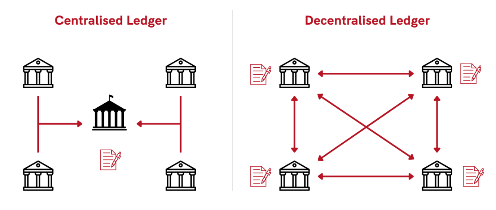

## Part 1: Core Architectural Themes

At its core, a blockchain is a distributed state machine with an append-only block history. Independent nodes verify the same protocol rules, which reduces reliance on a single trusted operator.

### How it works

**Execution payload**: Transactions and other execution messages are ordered into an execution payload (block body), then executed by full nodes with deterministic state-transition rules.

**Block chaining**: Each block header commits to prior history (for example, via parent hash) and to execution results (for example, state root / receipts commitment, depending on protocol design).

**Consensus and fork choice**: A proposer (or miner/leader in other designs) publishes candidate blocks. Nodes validate protocol rules locally, then follow consensus and fork-choice rules to determine canonical history and finality level.

### Key Characteristics

**Immutability (economic/finality bound)**: Rewriting finalized or deeply confirmed history requires violating consensus assumptions (for example, majority hash power or slashable stake thresholds), which is economically and operationally expensive.

**Transparency (public chains)**: Public permissionless chains expose block/transaction history for broad auditability. Permissioned systems can restrict read access.

**Security**: Cryptography ensures that data cannot be tampered with or faked

## 1. Common blockchain building blocks

- P2P networking and block/transaction propagation
- Transactions (state-transition inputs)
- Deterministic execution/state-transition function
- Block production role (for example, proposer/miner/leader)
- Consensus + fork-choice/finality rules
- Economic security/incentives (issuance, fees, slashing in PoS systems)

### 2. Network Topology and Access Control

Blockchain networks differ based on who can read state, submit transactions, and validate blocks.
- Public/Permissionless chains:
	- Anyone can create keys, run nodes, and submit transactions.
	- Security comes from open participation and economic incentives.
- Permissioned/Private/Consortium chains:
	- Participants are known, approved, and role-based.
	- These models prioritize confidentiality, governance control, and predictable performance.

### 3. Validators, Consensus, and Security Base

Consensus is the trust mechanism that orders and finalizes transactions.

In execution-layer terms, "consensus" is usually a stack of:

- Sybil resistance / block-author selection
- Fork choice (which head/canonical chain to follow)
- Finality rule (when reversion becomes infeasible or forbidden)

- Validator set:
	- Active participants that attest to validity/finality; proposer duties may rotate or be separately elected.
- Consensus mechanisms:
	
	
	Source: [101 Blockchains, Different Types of Consensus Algorithms Infographic](https://101blockchains.com/blockchain-infographics/)
	
	- PoW (Nakamoto-style):
		- Sybil resistance by expended computation/work.
		- Fork choice usually follows greatest cumulative work.
		- Finality is probabilistic and confidence grows with confirmations.
		- Security assumption: attacker cannot sustain majority hash power.
	- PoS (broad family):
		- Sybil resistance by stake-at-risk.
		- Proposers/attesters are selected by protocol; votes determine chain weight/head.
		- Finality can be explicit/economic (protocol-specific), with slashing for equivocation.
		- Security assumption: attacker cannot sustain controlling stake without severe economic cost.
	- PoS variants (governance/selection design choices):
		- DPoS: token holders elect a smaller producer set; high throughput, stronger governance centralization risk.
		- NPoS and related nomination models: nominators back validators; improves validator-set quality but adds governance complexity.
		- These are design variants of PoS, not separate fault models.
	- PoA (Proof of Authority):
		- Block authors are known/authorized identities.
		- Fast and operationally simple for permissioned or consortium deployments.
		- Trust model depends on governance/legal controls rather than open economic Sybil resistance.
	- BFT family (for example PBFT, Tendermint, HotStuff, IBFT):
		- Validators exchange signed votes in rounds.
		- Deterministic or near-instant finality after quorum certificates/commits.
		- Typical safety/liveness bounds tolerate up to f Byzantine nodes where n >= 3f + 1.
		- Common in permissioned systems and in committee-style PoS layers.
	- Avalanche-family and metastable voting protocols:
		- Repeated randomized sampling drives network convergence.
		- Can offer low-latency confirmation in high-throughput settings.
		- Finality and safety parameters are protocol-specific and must be evaluated from implementation assumptions.
	- CFT protocols (for example Raft, Multi-Paxos):
		- Leader-based replicated logs with majority quorum under crash-fault assumptions.
		- Do not tolerate Byzantine behavior and are not Sybil-resistant by themselves.
		- Suitable for trusted infrastructure components; generally unsuitable as core consensus for open permissionless chains.
	- Hybrid stacks:
		- Real systems often combine layers (for example PoS author selection + BFT finality gadget + protocol-specific fork choice).
		- Evaluate the full stack together: author selection, fork choice, finality, and economic penalties.

Execution-layer interpretation guidance:

- PoW/PoS primarily solve Sybil resistance and block-author selection.
- Fork choice resolves competing heads during propagation races.
- Finality rules define when reverting history is operationally/economically infeasible.
- Data structure choices (for example DAG-based ledgers) are not automatically consensus mechanisms by themselves.

Consensus references:

- [Ethereum consensus mechanism overview](https://ethereum.org/developers/docs/consensus-mechanisms/)
- [Ethereum PoS details (proposer, attestation, fork choice, finality)](https://ethereum.org/developers/docs/consensus-mechanisms/pos/)
- [Ethereum historical PoW model and probabilistic finality](https://ethereum.org/developers/docs/consensus-mechanisms/pow/)
- [Raft (CFT consensus for trusted clusters)](https://raft.github.io/)
- [Broad industry survey of consensus families](https://101blockchains.com/consensus-algorithms-blockchain/)

Security inheritance model:

- Layer 1 (L1):
	- Maintains its own consensus, security, and settlement.
- Rollups (L2):
	- Execute transactions in a separate execution environment and publish data/proofs/commitments to L1.
	- Settlement assurances depend on design details (proof system, data-availability path, bridge contracts, and sequencer assumptions).
- Sidechains:
	- Independent consensus and validator set.
	- Interact through bridges and do not inherit L1 base security.

### 4. Operational Mechanics and Tokenomics

- Governance:
	- On-chain: Upgrades are implemented through token-based voting.
	- Off-chain: Upgrades are coordinated through social, developer, or consortium processes.
- Tokenomics:
	- Defines issuance, utility, incentives, and fee-market rules.
	- Native assets often secure consensus and pay execution fees, though models vary by protocol.
- Execution-layer fee market (where implemented):
	- The proposer selects transactions from the mempool according to protocol validity and local ordering policy.
	- In EIP-1559-style systems, `baseFee` is protocol-computed from parent block gas usage vs gas target.
	- Users set fee caps (for example `maxFeePerGas`) and optional tips (for example `maxPriorityFeePerGas`), while final paid fee depends on `gasUsed` and effective gas price.
- Privacy and compliance:
	- Techniques include ZK proofs, TEEs, and selective disclosure.
	- The objective is verifiability with controlled data exposure.
- Interoperability:
	- Bridges, relays, and standards (for example, IBC) connect chains.
- Scalability:
	- Rollups, parallel execution, sharding, and modular architectures.

[More about Blockchain](https://kauri.io/#communities/Getting%20started%20with%20dapp%20development/blockchain-explained/)

Next step: [eth](/ethereum/eth/)