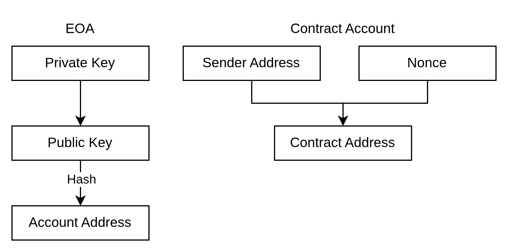

Ethereum accounts are identified by 20-byte addresses.

## Part 1: Account State Fields

Each Ethereum account stores four core fields:

- `nonce`
- `balance`
- `code`
- `storage`

## Part 2: Account Types

Ethereum has two account types. Both use the same four-field state model, but `code` and `storage` usage differs.

### Externally Owned Account (EOA)

- Controlled by a private key (public/private key pair).
- Can initiate transactions.
- `code` is empty.
- `storage` is empty.
- Creating an EOA does not require contract deployment gas.

### Contract Account

- Controlled by smart contract code.
- Can hold ETH and interact with EOAs and other contracts.
- Has non-empty `code` and can use `storage`.
- Creation requires deployment gas because bytecode and state are written to the chain.
- Cannot originate transactions by itself; execution is triggered by external transactions or internal calls.

## Part 3: Ethereum Address Generation

### EOA Address Derivation

1. Generate a private key `sk` (ECDSA over `secp256k1`).
2. Derive public key `pk` from `sk`.
3. Compute `keccak256(pk)`.
4. Take the last 20 bytes (160 bits) of that hash as the Ethereum address.

Example:

- `keccak256(pk) = 2a5bc342ed616b5ba5732269001d3f1ef827552ae1114027bd3ecf1f086ba0f9001d3f1ef827552ae1114027bd3ecf1f086ba0f9`
- `address = 0x001d3f1ef827552ae1114027bd3ecf1f086ba0f9`

### Contract Address Derivation

Contract addresses are derived from deployment context:

- `CREATE`: `new_address = hash(sender, nonce)`
- `CREATE2`: `new_address = hash(0xFF, sender, salt, bytecode)`

Both methods produce a contract address, but `CREATE2` enables deterministic address computation before deployment.

