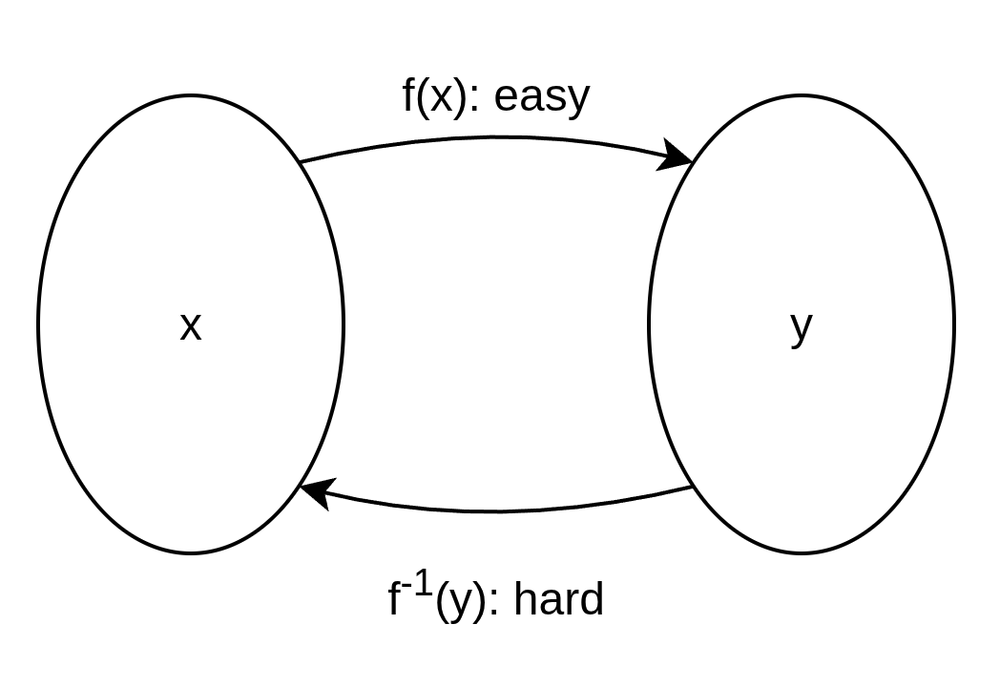
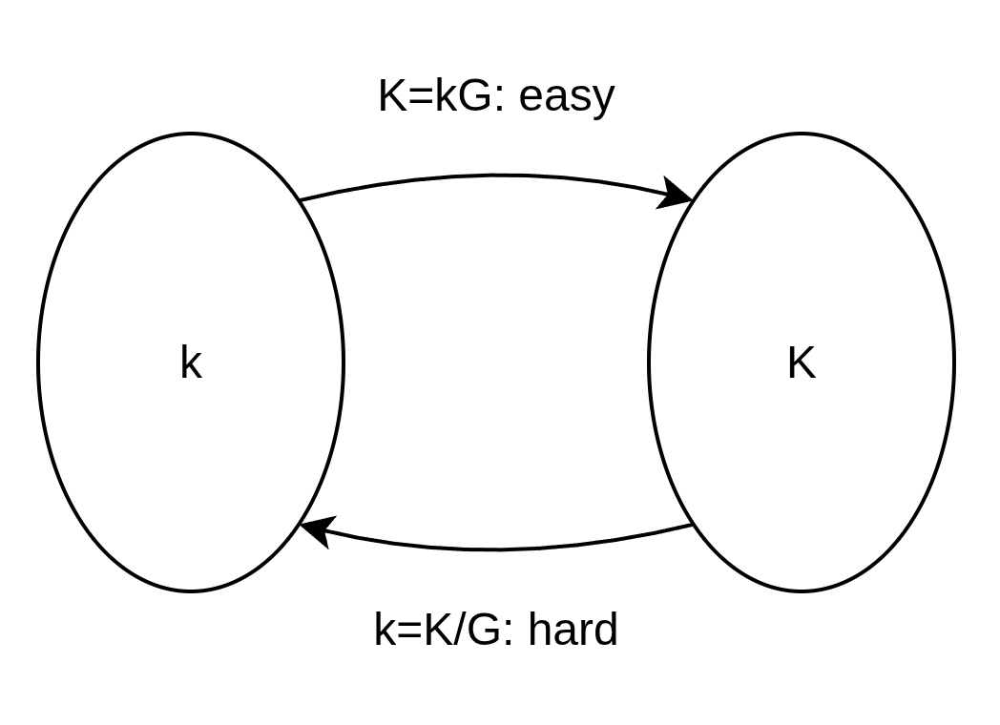

## Part 0: Block detail can be see

Note that, all communications with the Ethereum platform and between nodes (including transaction data) are unencrypted and can (necessarily) be read by anyone.

## Part 1: Public key cryptography (PKC)

**Used to control ownership of funds, in the form of private keys and addresses.**

PKC uses a one-way mathematical mapping: forward computation is efficient, but inversion is computationally infeasible.

In abstract form:

$$
y = f(x)\quad\text{is easy to compute, while }x = f^{-1}(y)\text{ is infeasible in practice.}
$$

In Ethereum elliptic-curve cryptography:

$$
K = kG
$$

Where $k$ is the private key, $G$ is a fixed generator point, and $K$ is the public key. Computing $K$ from $k$ is efficient, but recovering $k$ from $K$ is not practical.

This one-way property is what enables digital secrets (private keys) and unforgeable digital signatures, grounded in mathematical hardness assumptions.

### 1. Private keys

- A private key is a random number in a valid elliptic-curve range.
- Control of the private key equals control of the corresponding EOA funds and permissions.
- Private keys are never posted on-chain and must never be shared.

Security notes:

- Use strong entropy and a cryptographically secure RNG.
- Never use predictable random generation logic.
- Back up keys safely; loss of the key means irreversible loss of control.

### 2. Public keys

- Ethereum EOAs use elliptic curve cryptography on `secp256k1`.
- Public key derivation follows one-way math:

$$
K = kG
$$

- Where $k$ is the private key, $G$ is the generator point, and $K$ is the resulting public key.
- On `secp256k1`, the curve is:

$$
y^2 \equiv x^3 + 7 \pmod p
$$

- Deriving a public key from a private key is efficient:

$$
K = kG
$$

- Reversing that process is computationally infeasible. In informal notation:

$$
\frac{K}{G} \ne k
$$

### 3. Transaction signatures

- EOAs sign transaction payloads with ECDSA.
- Nodes verify signatures before accepting and executing transactions.
- Signature validation proves authorization without revealing the private key.

## Part 2: Detail for ECDSA

The **Elliptic Curve Digital Signature Algorithm (ECDSA)** is the protocol Ethereum uses to authorize transactions.

The basic elliptic-curve relation,

$$
Q = dG
$$

shows how a public key is derived from a private key. ECDSA goes further: it proves that a signer controls the private key associated with a public key, without revealing that private key.

### 1. Core variables

Before signing, ECDSA uses these values:

- $d$: the private key
- $Q$: the public key, where $Q = dG$
- $G$: the generator point on `secp256k1`
- $n$: the order of the curve
- $m$: the message or transaction data
- $z$: the hash of the message, produced by Keccak-256 in Ethereum

### 2. Signature generation

To create a signature, the wallet performs the following steps:

1. Pick a secure random nonce $k$, where $1 \le k \le n - 1$.
2. Compute the curve point:

$$
R = kG
$$

3. Set:

$$
r = x_R \bmod n
$$

4. Compute:

$$
s = k^{-1}(z + rd) \bmod n
$$

The signature is the pair $(r, s)$, and Ethereum transactions also include a recovery value $v$.

### 3. Signature verification

Anyone can verify the signature without knowing the private key $d$.

1. Compute the modular inverse:

$$
w = s^{-1} \bmod n
$$

2. Compute two intermediate values:

$$
u_1 = zw \bmod n
$$

$$
u_2 = rw \bmod n
$$

3. Reconstruct the verification point:

$$
X = u_1G + u_2Q
$$

4. The signature is valid if:

$$
x_X \equiv r \pmod n
$$

### 4. Why it is secure

- The verification equation is public, but the private key $d$ never appears in the network.
- Recovering $d$ from $Q = dG$ is the elliptic-curve discrete logarithm problem, which is computationally infeasible.
- A fresh nonce $k$ must be used for every signature. If $k$ is reused, the private key can be recovered with algebra.

In short, ECDSA lets Ethereum prove authorization mathematically, while keeping the private key secret.

## Part 3: Hashing and Address Derivation

### 1. Cryptographic hash properties

Ethereum depends heavily on one-way hash behavior:

- Deterministic outputs for the same input.
- Strong avalanche effect for small input changes.
- Practical preimage and collision resistance.

### 2. Keccak-256 in Ethereum

- Ethereum uses Keccak-256 (not FIPS-202 SHA-3 output compatibility).
- Keccak is used across IDs, commitments, trie roots, and address derivation.

### 3. Address derivation

- EOA address = last 20 bytes of `keccak256(publicKey)`.
- Displayed in hex form with `0x` prefix.
- Checksum-style mixed-case encoding (ERC-55) helps detect typing mistakes.

## Part 4: Commitments in Execution and State

Ethereum commits global data using authenticated structures:

- `stateRoot`: commitment to global account and storage state.
- `transactionsRoot`: commitment to included transactions.
- `receiptsRoot`: commitment to outcomes and logs.

These roots allow compact verification of large datasets.

## Part 5: Validator Cryptography (Consensus Layer)

PoS consensus requires authenticated validator messages.

- Validators sign attestations and proposals.
- Misbehavior (for example, conflicting signatures) becomes provable.
- Provable misbehavior enables slashing.

Ethereum uses BLS signatures for validator messaging because they support aggregation:

- Many signatures can be compressed into one aggregate signature.
- Verification cost and block footprint are reduced versus verifying each vote independently.
- This is a key scaling property for large validator sets.

## Part 6: KZG Commitments and Blob Era

With proto-danksharding (EIP-4844), Ethereum introduced blob-related commitment verification.

Conceptually:

- Data is represented in polynomial form.
- A commitment is published on-chain.
- Small proofs allow validators and nodes to verify specific claims about that committed data.

KZG commitment schemes provide:

- Constant-size commitments.
- Small proofs.
- Efficient verification independent of full data size.

This direction supports Ethereum scalability and data-availability roadmaps.

## Part 7: Summary

Ethereum cryptography spans two major domains:

- Execution-layer cryptography: ECDSA, Keccak-256, and trie commitments.
- Consensus-layer and data cryptography: BLS aggregation and KZG commitments.

Together, these mechanisms make decentralized verification practical at global scale.

Next step: [eth-account](/ethereum/eth-account/)
