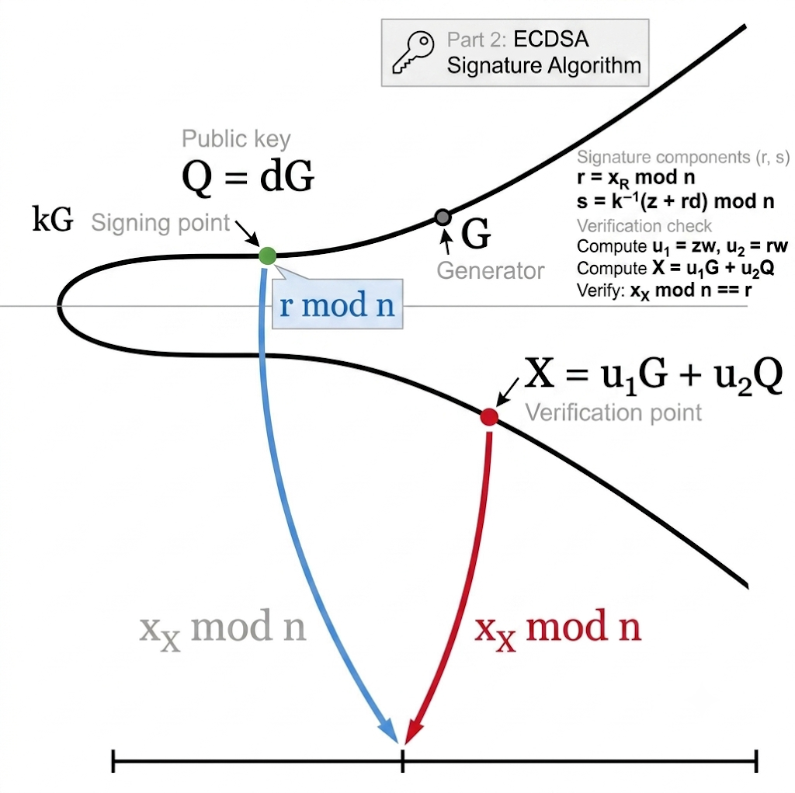

## Part 0: Visibility vs Transport Encryption

Important distinction:

- On-chain data (transactions, receipts, state commitments) is publicly verifiable by design.
- Peer-to-peer transport is authenticated and encrypted in modern client stacks (for example RLPx on EL and encrypted libp2p channels on CL).

So Ethereum is public, but not every byte in transit is plaintext on the wire.

## Part 1: Public key cryptography (PKC)

**Used to control ownership of funds, in the form of private keys and addresses.**

PKC uses a one-way mathematical mapping: forward computation is efficient, but inversion is computationally infeasible.

In abstract form:

$$
y = f(x)\quad\text{is easy to compute, while }x = f^{-1}(y)\text{ is infeasible in practice.}
$$

In Ethereum elliptic-curve cryptography:

$$
K = kG
$$

Where $k$ is the private key, $G$ is a fixed generator point, and $K$ is the public key. Computing $K$ from $k$ is efficient, but recovering $k$ from $K$ is not practical.


This one-way property is what enables digital secrets (private keys) and unforgeable digital signatures, grounded in mathematical hardness assumptions.

### 1. Private keys

- A private key is a uniformly random integer in the valid `secp256k1` scalar range (`1 <= k < n`).
- Control of the private key equals control of the corresponding EOA funds and permissions.
- Private keys are never posted on-chain and must never be shared.

Security notes:

- Use strong entropy and a cryptographically secure RNG.
- Never use predictable random generation logic.
- Back up keys safely; loss of the key means irreversible loss of control.

### 2. Public keys

- Ethereum EOAs use elliptic curve cryptography on `secp256k1`.
- Public key derivation follows one-way math:

$$
K = kG
$$

- Where $k$ is the private key, $G$ is the generator point, and $K$ is the resulting public key.
- On `secp256k1`, the curve is:

$$
y^2 \equiv x^3 + 7 \pmod p
$$

- Deriving a public key from a private key is efficient:

$$
K = kG
$$

- Reversing that process is computationally infeasible. In informal notation:

$$
\frac{K}{G} \ne k
$$

### 3. Transaction signatures

- EOAs sign transaction payloads with ECDSA.
- Nodes verify signatures before accepting and executing transactions.
- Signature validation proves authorization without revealing the private key.
- Ethereum additionally enforces signature validity constraints (including canonical low-`s` behavior for transactions) to reduce malleability.

## Part 2: Detail for ECDSA

The **Elliptic Curve Digital Signature Algorithm (ECDSA)** is the protocol Ethereum uses to authorize transactions.



The basic elliptic-curve relation,

$$
Q = dG
$$

shows how a public key is derived from a private key. ECDSA goes further: it proves that a signer controls the private key associated with a public key, without revealing that private key.

### 1. Core variables

Before signing, ECDSA uses these values:

- $d$: the private key
- $Q$: the public key, where $Q = dG$
- $G$: the generator point on `secp256k1`
- $n$: the order of the curve
- $m$: the message or transaction data
- $z$: the Keccak-256 digest of the Ethereum signing payload

### 2. Signature generation

To create a signature, the wallet performs the following steps:

1. Pick a secure random nonce $k$, where $1 \le k \le n - 1$.
2. Compute the curve point:

$$
R = kG
$$

3. Set:

$$
r = x_R \bmod n
$$

4. Compute:

$$
s = k^{-1}(z + rd) \bmod n
$$

The signature is the pair $(r, s)$, and Ethereum transactions also include a recovery/parity field (historically `v`; in typed transactions, y-parity plus chain/domain fields in the signing payload).

### 3. Signature verification

Anyone can verify the signature without knowing the private key $d$.

1. Compute the modular inverse:

$$
w = s^{-1} \bmod n
$$

2. Compute two intermediate values:

$$
u_1 = zw \bmod n
$$

$$
u_2 = rw \bmod n
$$

3. Reconstruct the verification point:

$$
X = u_1G + u_2Q
$$

4. The signature is valid if:

$$
x_X \equiv r \pmod n
$$

Clients also enforce range/canonical checks on signature components before accepting a transaction as valid.

### 4. Why it is secure

- The verification equation is public, but the private key $d$ never appears in the network.
- Recovering $d$ from $Q = dG$ is the elliptic-curve discrete logarithm problem, which is computationally infeasible.
- A fresh nonce $k$ must be used for every signature. If $k$ is reused, the private key can be recovered with algebra.

In short, ECDSA lets Ethereum prove authorization mathematically, while keeping the private key secret.

### 5. Mini Worked Example (ECDSA)

To make this mechanism concrete, here is a small ECDSA walkthrough with tiny numbers.

In blockchains and smart contracts, transaction authorization is backed by these same math operations. Real systems use extremely large values, but this toy example keeps numbers small so every step can be checked by hand.

#### 5.1 Setup (Domain Parameters)

Define a mini curve setting and message:

- Curve order $n = 11$ (so $11G = \mathcal{O}$, and scalar arithmetic is modulo 11)
- Private key $d = 4$
- Public key $Q = dG = 4G$
- Message hash integer $z = 5$

#### 5.2 Signing Process (Blue Path)

We generate a signature $(r, s)$ for $z = 5$ with private key $d = 4$.

1. Choose nonce $k = 3$ with $1 \le k \le n-1$.
2. Compute point $kG = 3G$. For this example, assume the $x$-coordinate of $3G$ is $x = 6$.
3. Compute:

$$
r = x \bmod n = 6 \bmod 11 = 6
$$

4. Compute $s = k^{-1}(z + rd) \bmod n$.
	First find $k^{-1}$ modulo 11. Since $3 \times 4 = 12 \equiv 1 \pmod{11}$, we have $k^{-1} = 4$.
5. Substitute values:

$$
s = 4 \times (5 + 6 \times 4) \bmod 11
$$

$$
s = 4 \times (5 + 24) \bmod 11
$$

$$
s = 4 \times 29 \bmod 11
$$

$$
s = 116 \bmod 11 = 6
$$

Final signature:

$$
(r, s) = (6, 6)
$$

#### 5.3 Verification Process (Red Path)

Now a verifier has $z = 5$, $Q = 4G$, and $(r, s) = (6, 6)$.

1. Compute $w = s^{-1} \bmod n$.
	Since $6 \times 2 = 12 \equiv 1 \pmod{11}$, $w = 2$.
2. Compute:

$$
u_1 = zw \bmod n = 5 \times 2 \bmod 11 = 10
$$

$$
u_2 = rw \bmod n = 6 \times 2 \bmod 11 = 1
$$

3. Compute verification point:

$$
X = u_1G + u_2Q = 10G + 1(4G) = 14G
$$

4. Reduce by group order $n=11$:

$$
X = (14 \bmod 11)G = 3G
$$

#### 5.4 Final Check (Arrow Intersection)

The verifier got $X = 3G$, which matches the signer's earlier point $kG = 3G$.
Therefore the $x$-coordinate also matches:

$$
x_X \bmod 11 = r
$$

$$
6 = 6
$$

The signature verifies successfully, without revealing private key $d$ or nonce $k$.

### 6. EIP-1559 Signing Example (ethers.js)

This example shows how local signing works in practice with ECDSA, then broadcasts the signed raw transaction.

Install and run:

```bash
npm install ethers
node eip1559_tx.js
```

```js
import { ethers } from "ethers";

async function main() {
	// Create provider with your RPC endpoint
	const provider = new ethers.JsonRpcProvider("https://ethereum-sepolia-rpc.publicnode.com");

	// Use an environment variable or secure vault in real usage.
	const privKey = process.env.PRIVATE_KEY || "0xYOUR_PRIVATE_KEY";
	if (privKey === "0xYOUR_PRIVATE_KEY") {
		throw new Error("Set PRIVATE_KEY before running this script.");
	}

	// Create a wallet instance
	const wallet = new ethers.Wallet(privKey, provider);

	// Get nonce and create transaction data
	const txData = {
		nonce: await provider.getTransactionCount(wallet.address),
		to: "0xb0920c523d582040f2bcb1bd7fb1c7c1ecebdb34",
		value: ethers.parseEther("0.0001"),
		gasLimit: ethers.toBeHex(0x30000),
		maxFeePerGas: ethers.parseUnits("100", "gwei"),
		maxPriorityFeePerGas: ethers.parseUnits("2", "gwei"),
		data: "0x",
		chainId: 11155111,
	};

	// Compute the signing digest of the unsigned typed transaction payload
	const unsignedTx = ethers.Transaction.from(txData).unsignedSerialized;
	console.log("RLP-Encoded Tx (Unsigned):", unsignedTx);
	const txHash = ethers.keccak256(unsignedTx);
	console.log("Tx Hash (Unsigned):", txHash);

	// Sign the transaction locally
	const signedTx = await wallet.signTransaction(txData);
	console.log("Signed Raw Transaction:", signedTx);

	// Broadcast and wait for confirmation
	const txResponse = await provider.broadcastTransaction(signedTx);
	console.log("Transaction Hash:", txResponse.hash);
	const receipt = await txResponse.wait();
	console.log("Transaction Receipt:", receipt);
}

main().catch(console.error);
```

```
$ node eip1559_tx.js 
RLP-Encoded Tx (Unsigned): 0x02f283aa36a714847735940085174876e8008303000094b0920c523d582040f2bcb1bd7fb1c7c1ecebdb34865af3107a400080c0
Tx Hash (Unsigned): 0x31d43a580534a77c71324a8434df6f2df993b3d551b29d4b70d8a889768a53f7
Signed Raw Transaction: 0x02f87583aa36a714847735940085174876e8008303000094b0920c523d582040f2bcb1bd7fb1c7c1ecebdb34865af3107a400080c001a03f8ed18cb03ee0fe3fbc3f0a7477a2f68db6ec84450e77e702b82a3f2c873aa4a0205c4f6a16ea8ad13a148cc3105814cd4a6860cd26a771651199c85ccb7c7f0f
Transaction Hash: 0x07bfbeb337e19763a1f74d989dae2953807dcb06822354cfefb16405a11beb93
Transaction Receipt:  TransactionReceipt {
  provider: JsonRpcProvider {},
  to: '0xB0920c523d582040f2BCB1bD7FB1c7C1ECEbdB34',
  from: '0x7e41354AfE84800680ceB104c5Fc99eCB98A25f0',
  contractAddress: null,
  hash: '0x07bfbeb337e19763a1f74d989dae2953807dcb06822354cfefb16405a11beb93',
  index: 1,
  blockHash: '0x0ac051e8f615805c69eec6e193e39637adeb7cf314a0098d455e7d9ac395a7ee',
  blockNumber: 7135937,
  logsBloom: '0x00000000000000000000000000000000000000000000000000000000000000000000000000000000000000000000000000000000000000000000000000000000000000000000000000000000000000000000000000000000000000000000000000000000000000000000000000000000000000000000000000000000000000000000000000000000000000000000000000000000000000000000000000000000000000000000000000000000000000000000000000000000000000000000000000000000000000000000000000000000000000000000000000000000000000000000000000000000000000000000000000000000000000000000000000000000',
  gasUsed: 21000n,
  blobGasUsed: null,
  cumulativeGasUsed: 42000n,
  gasPrice: 3096751769n,
  blobGasPrice: null,
  type: 2,
  status: 1,
  root: undefined
}

```


## Part 3: Hashing and Address Derivation

### 1. Cryptographic hash properties

Ethereum depends heavily on one-way hash behavior:

- Deterministic outputs for the same input.
- Strong avalanche effect for small input changes.
- Practical preimage and collision resistance.

### 2. Keccak-256 in Ethereum

- Ethereum uses Keccak-256 (not FIPS-202 SHA-3 output compatibility).
- Keccak is used across IDs, commitments, trie roots, and address derivation.

### 3. Address derivation

- EOA address = last 20 bytes of `keccak256(uncompressedPublicKey[1:])` (i.e., without the `0x04` prefix byte).
- Displayed in hex form with `0x` prefix.
- Checksum-style mixed-case encoding (ERC-55) helps detect typing mistakes.

## Part 4: Commitments in Execution and State

Ethereum commits global data using authenticated structures:

- `stateRoot`: commitment to global account/storage state (Merkle-Patricia trie root).
- `transactionsRoot`: commitment to included transactions.
- `receiptsRoot`: commitment to execution outcomes and logs.

These roots allow compact verification of large datasets.

## Part 5: Validator Cryptography (Consensus Layer)

PoS consensus requires authenticated validator messages.

- Validators sign attestations and proposals.
- Misbehavior (for example, conflicting signatures) becomes provable.
- Provable misbehavior enables slashing.

Ethereum consensus uses BLS signatures (BLS12-381) for validator messaging because they support aggregation:

- Many signatures can be compressed into one aggregate signature.
- Verification cost and block footprint are reduced versus verifying each vote independently.
- This is a key scaling property for large validator sets.

## Part 6: KZG Commitments and Blob Era

With proto-danksharding (EIP-4844), Ethereum introduced blob-related commitment verification.

Conceptually:

- Blob data is represented as polynomial evaluations over a finite field.
- A KZG commitment to blob data is included in block-related data structures.
- Small proofs allow validators and nodes to verify point-evaluation claims without downloading all blob data from every peer.

KZG commitment schemes provide:

- Constant-size commitments.
- Small proofs.
- Efficient verification independent of full data size.

This direction supports Ethereum scalability and data-availability roadmaps.

## Part 7: Summary

Ethereum cryptography spans two major domains:

- Execution-layer cryptography: ECDSA, Keccak-256, and trie commitments.
- Consensus-layer and data cryptography: BLS aggregation and KZG commitments.

Together, these mechanisms make decentralized verification practical at global scale.
