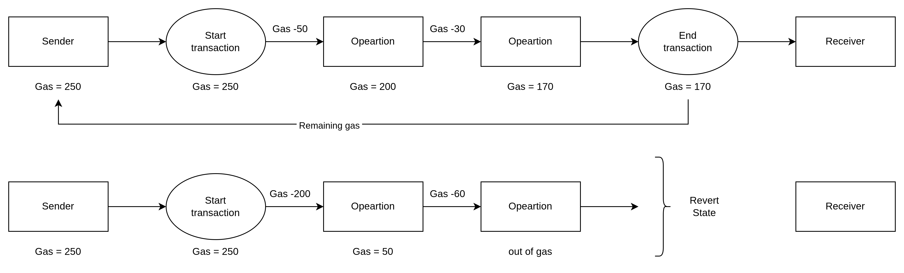

Gas is Ethereum's metering system. It prevents infinite computation and helps protect the network from denial-of-service behavior.


## Part 0: Reference Gas Price Quote

```bash
# cast should be installed
$ cast gas-price --rpc-url https://ethereum-sepolia-rpc.publicnode.com
4845187414
```
## Part 1: Fee Formula (Execution-Layer Accurate)

Note:

- Affordability check uses `gasLimit * maxFeePerGas`.
- Final fee charged uses `gasUsed * effectiveGasPrice`.

| Gas System Field     | What It Represents                               | Role in the Fee System                               |
| -------------------- | ------------------------------------------------ | ---------------------------------------------------- |
| gasLimit             | Maximum execution gas the sender authorizes      | Prevents unbounded computation and caps gas exposure |
| gasUsed              | Actual execution gas consumed by the transaction | Final fee is charged on this value, not gasLimit     |
| gasPrice             | Legacy flat fee per gas unit                     | Used by pre-EIP-1559 (type-0) transactions           |
| baseFee              | Network-set base gas price per block             | Burned under EIP-1559 and adjusts with demand        |
| maxPriorityFeePerGas | Sender-set maximum tip per gas for proposer      | Incentivizes faster inclusion                        |
| maxFeePerGas         | Sender-set maximum total fee per gas             | Caps worst-case effective gas price                  |
| maxFeePerBlobGas     | Sender-set max blob fee per blob gas (type-3)    | Caps blob-fee exposure for EIP-4844 transactions     |
| blobBaseFee          | Protocol-set blob base fee (type-3 market)       | Burned for blob data under EIP-4844                  |

For type-2 (EIP-1559) transactions, total execution fee paid is:

$$
TotalFeePaid = gasUsed \times effectiveGasPrice
$$

Practical cap rule:

$$
effectiveGasPrice = \min(maxFeePerGas,\ baseFee + maxPriorityFeePerGas)
$$

Where:

- `baseFee` is protocol-set and burned. 
- `effectivePriorityFee` is the validator tip actually paid.
- If `baseFee + maxPriorityFeePerGas > maxFeePerGas`, the effective priority fee is reduced.
- Equivalently:

$$
effectivePriorityFee = \max\left(0,\ \min\left(maxPriorityFeePerGas,\ maxFeePerGas - baseFee\right)\right)
$$

- If `baseFee > maxFeePerGas`, the transaction is not includable in that block.

For type-3 (EIP-4844) transactions, total fee has two components:

$$
TotalFeePaid = gasUsed \times effectiveGasPrice + blobGasUsed \times blobBaseFee
$$

With includability constraints:

- `baseFee <= maxFeePerGas`
- `blobBaseFee <= maxFeePerBlobGas`

Note: receipt `effectiveGasPrice` refers to execution gas pricing, not blob-fee pricing.

## Example

ETH transfer gas used is typically `21,000`.

If:

- `baseFee = 10 gwei`
- `priority fee = 2 gwei`

Then:

$$
Fee = 21000 \times (10 + 2) = 252000\ gwei = 0.000252\ ETH
$$

## Part 2: Base Fee Adjustment Logic

Sender transactions cannot set `baseFee`. The protocol computes it deterministically from the parent block.

### Variable Ownership and Source of Truth

| Variable               | What It Means                                           | Who/What Decides It                                                                          | Notes                                                                     |
| ---------------------- | ------------------------------------------------------- | -------------------------------------------------------------------------------------------- | ------------------------------------------------------------------------- |
| `BaseFee_parent`       | Base fee in the parent block                            | Protocol consensus (computed from previous block state)                                      | Not manually chosen by validators; every node derives the same value.     |
| `GasUsed_parent`       | Total actual execution gas consumed in the parent block | Emerges from real transaction execution in that block                                        | This is the chain-wide actual gas used by included transactions.          |
| `GasLimit_parent`      | Parent block gas limit ceiling                          | Validator/proposer proposes updates within protocol bounds; consensus rules enforce validity | Can change gradually, not arbitrarily in one block.                       |
| `ElasticityMultiplier` | Multiplier that defines target vs max block gas         | Protocol constant from EIP-1559                                                              | On Ethereum mainnet this is 2, so target is half of gas limit.            |
| `GasTarget_parent`     | Target gas level used for base fee adjustment           | Deterministically derived by protocol formula                                                | Computed as `GasLimit_parent / ElasticityMultiplier`, not manually set.   |
| `BaseFee_next`         | Base fee for the next block                             | Protocol consensus calculation                                                               | Every client computes the same next value using integer arithmetic rules. |


Conceptual update rule:

$$
BaseFee_{next} = BaseFee_{parent} \times \left(1 + \frac{GasUsed_{parent} - GasTarget_{parent}}{GasTarget_{parent}} \times \frac{1}{8}\right) 
$$

With:

$$
GasTarget_{parent} = \frac{GasLimit_{parent}}{ElasticityMultiplier}
$$


Important implementation note:

- Clients compute this using integer arithmetic and guardrails (no floating-point in consensus logic).

### Implementation Rules (Simplified)

1. If `parent.GasUsed == parentGasTarget`, base fee stays unchanged.
2. If `parent.GasUsed > parentGasTarget`, base fee increases (with minimum increment guard).
3. If `parent.GasUsed < parentGasTarget`, base fee decreases (bounded at zero).

### Practical Interpretation of 15M / 30M

When gas limit is around 30,000,000 and elasticity multiplier is 2:

- Target gas is about 15,000,000.
- GasLimit is about 30,000,000.

### Standard Scenarios

1. `GasUsed = GasTarget`: base fee unchanged.
2. `GasUsed = 2 * GasTarget`: base fee increases by up to about 12.5%.
3. `GasUsed = 0`: base fee decreases by up to about 12.5%.

### Worked Example (100 gwei parent base fee)

Assume:

- `BaseFee_parent = 100 gwei`
- `GasTarget_parent = 15,000,000`
- `GasUsed_parent = 22,500,000`

Then:

$$
\frac{GasUsed-GasTarget}{GasTarget} = \frac{22.5-15}{15} = 0.5
$$

Adjustment factor:

$$
0.5 \times \frac{1}{8} = 0.0625
$$

Conceptual result:

$$
BaseFee_{next} = 100 \times (1 + 0.0625) = 106.25\ gwei
$$

In execution, clients round by integer-wei math per consensus rules.

## Part 3: Transaction Fee Lifecycle

### 1. Transaction fee process

The 3 gas fields users set in type-2 transactions:

| Field                  | Description                                              |
| ---------------------- | -------------------------------------------------------- |
| `gasLimit`             | Maximum gas units the transaction is allowed to consume. |
| `maxFeePerGas`         | Maximum total price per gas unit you are willing to pay. |
| `maxPriorityFeePerGas` | Maximum validator tip per gas unit.                      |

- You only pay for `gasUsed`, not all of `gasLimit`.
- The execution-layer affordability bound before execution is:

$$
value + gasLimit \times maxFeePerGas
$$

- For type-3 transactions, affordability also includes blob-fee allowance:

$$
value + gasLimit \times maxFeePerGas + blobGasUsed \times maxFeePerBlobGas
$$

- For type-2 transactions, the final charged transaction fee is:

$$
actualFeePaid = gasUsed \times effectiveGasPrice
$$

- For type-3 transactions, total charged fee includes execution gas plus blob gas:

$$
actualFeePaid = gasUsed \times effectiveGasPrice + blobGasUsed \times blobBaseFee
$$

- Conceptually, unused allowance can be viewed as:

$$
unusedAllowance = gasLimit \times maxFeePerGas - gasUsed \times effectiveGasPrice
$$

- Type-3 transactions also have blob-fee headroom:

$$
blobAllowanceRemainder = blobGasUsed \times (maxFeePerBlobGas - blobBaseFee)
$$

Refund behavior:

- If `gasLimit` is higher than `gasUsed`, unused gas is not charged.
- For EIP-1559 transactions, the difference between your maximum allowance and actual fee is never paid.

Key rules:

- Upfront affordability: the sender must have enough ETH to cover `value + gasLimit * maxFeePerGas` before execution starts.
- Out of gas: if execution exhausts gas, the transaction fails/reverts, but gas spent is still charged.



**Example for out of gas**

Imagine you are trying to execute a complex smart contract interaction, but you set your gas limit too low.

- **Gas Required by Contract:** $80,000$ units
- **Your Gas Limit:** $50,000$ units
- **Base Fee:** $20 \text{ Gwei}$
- **Priority Fee:** $2 \text{ Gwei}$

**Step 1: The EVM Execution**

The EVM starts processing the transaction. It completes the first few operations, consuming gas along the way. Once it hits $50,000$ units, it realizes it needs more to finish but is blocked by your limit.

**Step 2: The Revert**

The transaction halts. The EVM reads "Out of Gas," cancels the execution, and reverts the state.

**Step 3: The Charge**

Even though it failed, the network charges you for the $50,000$ units of work it performed:

1. **Calculate Effective Gas Price:** $20 \text{ Gwei} + 2 \text{ Gwei} = 22 \text{ Gwei}$
2. **Calculate Total Cost in Gwei:** $50,000 \times 22 \text{ Gwei} = 1,100,000 \text{ Gwei}$
3. **Convert to ETH:** $1,100,000 / 10^9 = 0.0011 \text{ ETH}$

You lose **$0.0011 \text{ ETH}$**, and the transaction fails.

You can use the interactive calculator below to explore how different limits and network fees impact the cost of both successful and Out of Gas transactions.

### 2. Validator payment

- Validator/proposer receives priority-fee portion on used gas.
- Under EIP-1559, validator payout excludes base fee.
- Under EIP-4844, blob base fee is also burned (not paid to validator).

### 3. Base fee burn

- Base fee on used gas is removed from supply.
- It is not credited to validator balance.

```python
# EIP-1559 burn accounting (conceptual)
burn_amount = gas_used * base_fee_per_gas
validator_tip = gas_used * effective_priority_fee_per_gas

total_deduction = burn_amount + validator_tip # total fee

sender_balance -= total_deduction # fee charged

total_supply -= burn_amount      # permanently burned
validator_balance += validator_tip

# EIP-4844 extension (type-3)
blob_burn_amount = blob_gas_used * blob_base_fee_per_gas
total_supply -= blob_burn_amount
```

## Part 4: ETH Supply and Burn Dynamics (EIP-1559)

### Balanced equation

ETH scarcity is a dynamic balance:

$$
\Delta Supply = New\ Issuance - Burn\ Amount
$$

### New issuance

- Ethereum issues new ETH to pay validators for consensus security.
- A common recent magnitude is roughly ~2,700 ETH/day, but this is not fixed.
- Issuance scales with validator participation; in simplified terms, aggregate issuance grows sublinearly (approximately with the square root of total ETH staked).

#### A) New issuance Example, for more detail please go to [PoS page](/ethereum/eth-pos/)

Assume:

- Active validators = 600,000
- Effective balance per validator (example assumption) = 32 ETH = 32 * 10^9 gwei

Formula:
$$
BaseReward = \frac{EffectiveBalance \times 64}{\sqrt{TotalActiveBalance} \times 4}
$$

$$
ProposerShare \approx attestations  \times \frac{1}{8} \times BaseReward
$$

$$
ValidatorReward_{max} \approx \frac{7}{8} \times BaseReward + \frac{priority fee}{validators}
$$


Thus,
$$
New issuance = ProposerShare + ValidatorReward - priority fee
$$

### Burn mechanism

- For each included transaction, the protocol burns the base-fee portion:

$$
Burn = gasUsed \times baseFee
$$

- High activity periods can push burn above issuance (net deflation).
- Lower L1 fee periods, including periods of higher activity on L2 after Dencun blob scaling, can reduce L1 burn below issuance (mild net inflation).

ETH Supply in real-time: [ETH supply](https://ultrasound.money/)

References: [1](https://liquidityfinder.com/insight/crypto/the-ultimate-guide-to-gas-fees-explained-simply), [2](https://ethereum.org/developers/docs/intro-to-ether/), [3](https://ethereum.org/eth/supply/), [4](https://www.fidelitydigitalassets.com/research-and-insights/understanding-bitcoin-and-ethereum-supply), [5](https://bit-digital.com/blog/understanding-ethereum-deflationary-supply/)

### Guardrail intuition (economic, not a hard protocol invariant)

- ETH is not expected to mechanically burn to zero in practice.
- If ETH becomes very scarce, validator yields and market dynamics can incentivize more staking and dampen fee-burning demand growth.

Reference: [1](https://www.binance.com/en-IN/square/post/586931)

## Part 5: The Dual-Token Model (Alternative Approach)

### Setup

Some chains use a two-token structure (for example, VeChain VET/VTHO and NEO/"GAS"):

- Primary token: governance, staking, and core network value.
- Secondary token: utility gas token used for fees and often burned.

Reference: [1](https://blog.accubits.com/understanding-dual-token-economy-and-its-benefits/)

### Enterprise advantage

- Separating the gas token can reduce fee volatility for users and enterprises.
- This can improve operating-cost predictability when gas-token policy is actively managed.

### Crypto-economic tradeoff

- Decoupling fee burn from the primary token can weaken direct value-capture feedback to the primary asset.
- In practice, this may reduce alignment between network usage and primary-token scarcity, depending on chain design and governance.
