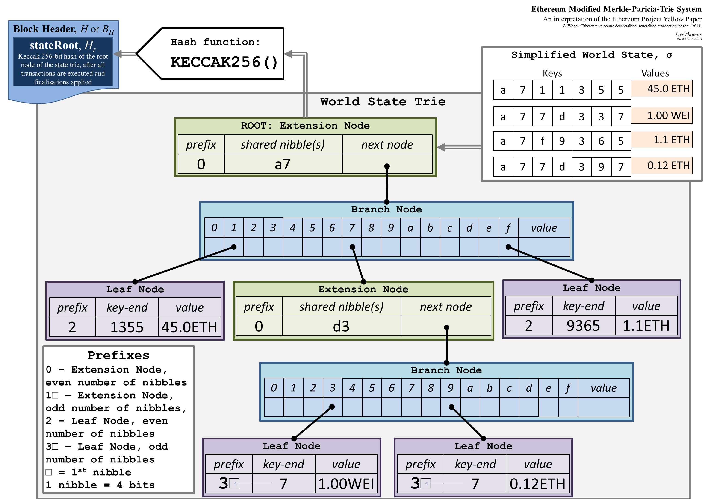

## Part 1: Why These Data Structures Matter

Ethereum execution clients must prove that block data and state data are consistent with header commitments.

The block header commits to key roots:

- `stateRoot`
- `transactionsRoot`
- `receiptsRoot`

These commitments let nodes verify data integrity and inclusion proofs without trusting a single database copy.

## Part 2: Merkle Tree Basics

A Merkle tree is a binary hash tree where:

1. Leaves hash data items.
2. Internal nodes hash child hashes.
3. Root hash commits to the full set.

Core property:

- Any leaf change changes the root.

In Bitcoin, Merkle trees are mainly used to commit block transactions via a transaction Merkle root.

```
          Root
         /    \
      H12      H34
      / \      / \
    H1  H2   H3  H4

Result:
Data2 
↓
H2 change
↓
H12 change
↓
Root change

```


## Part 3: Ethereum's Merkle Patricia Trie (MPT)

Ethereum uses a Modified Merkle Patricia Trie (MPT) for authenticated key-value data, instead of a simple binary Merkle tree.

What it stores at a high level:

- State trie: maps each account address to account data (nonce, balance, code hash, storage root).
- Storage trie (one per contract account): maps storage slot keys to storage values.
- Transactions trie (per block): maps transaction index to transaction data.
- Receipts trie (per block): maps transaction index to receipt data.

Why this structure is authenticated:

1. Trie paths make key-based lookup and update deterministic.
2. Every node is encoded and hashed.
3. The top hash (root) is committed in the block header.
4. Any change to a covered key/value changes hashes up the path and therefore changes the root.

Minimal node/path concepts (enough to reason about proofs):

- Branch node: up to 16 child pointers (one for each hex nibble) plus an optional value.
- Extension node: compresses a shared path segment when there is no branch decision yet.
- Leaf node: ends a path and stores the final value.
- Nibble path: keys are traversed as hex half-bytes (`0` to `f`), one nibble per step.

This "Patricia" path compression is why extension/leaf nodes exist: long single-child chains are compacted.

At a high level, Ethereum commits these tries in execution-layer block headers via:

- `stateRoot`
- `transactionsRoot`
- `receiptsRoot`
  


Source: [ELI5 How does a Merkle-Patricia-trie tree work](https://ethereum.stackexchange.com/questions/6415/eli5-how-does-a-merkle-patricia-trie-tree-work)
	
## Part 4: The Three Header Roots in EL Context

### 1. State Root (`stateRoot`)

Commits the full post-block world state through the global state trie.

Practical meaning: if two nodes execute the same block correctly, they should derive the same `stateRoot`.

### 2. Transactions Root (`transactionsRoot`)

Commits the block's ordered transactions through the per-block transactions trie.

Practical meaning: transaction inclusion and order are both covered by the commitment.

### 3. Receipts Root (`receiptsRoot`)

Commits receipts through the per-block receipts trie (status, cumulative gas used, logs bloom, logs, and related fields).

Practical meaning: execution outcomes and emitted logs are committed, not just raw transactions.

Execution-layer validation checks that roots recomputed from block data and state transitions match the roots claimed in the block header.

## Part 5: Proofs and Verification Intuition

A Merkle-Patricia proof is a set of trie nodes that lets a verifier check a claim against a trusted header root.

Typical claim examples:

- "This account had this value under `stateRoot`."
- "This storage slot had this value under `stateRoot`."
- "This transaction or receipt is included under this block root."

Verification intuition:

1. Start from the query key (address, storage slot key, or tx index key).
2. Walk the nibble path using the provided nodes (branch/extension/leaf transitions).
3. Re-encode and hash each visited node.
4. Confirm child references and path segments are consistent.
5. Confirm the final reconstructed top hash equals the trusted root from the block header.
6. Confirm the terminal value matches the claimed value (or confirms non-inclusion, when applicable).

Why this works:

- The verifier does not need the full database.
- Any tampering with node content, path, or value changes hashes and breaks the root match.
- Trust is anchored in the block header root, not in the proof provider.

## Part 6: Performance and Design Tradeoffs

MPT strengths:

- Strong commitment security model.
- Deterministic, consensus-safe encoding and hashing.
- Supports authenticated key-value queries.

MPT pain points:

- Larger proof sizes than newer commitment schemes.
- Expensive witness sizes for stateless validation goals.
- Database complexity under frequent state updates.

## Part 7: Verkle Trees (Roadmap Direction)

Verkle trees are proposed as a future commitment structure to reduce proof sizes and improve stateless-client feasibility.

High-level motivation:

1. Smaller witnesses for state proofs.
2. Better scalability for proof-heavy workflows.
3. Improved path toward more efficient stateless verification.

Important status note:

- Verkle migration is a roadmap effort and depends on protocol-fork rollout.
- Always check current mainnet fork status before assuming production deployment.

## Part 8: Practical Reading Path

1. Start with Merkle tree basics: hash chaining and root commitments.
2. Learn MPT as an authenticated map: key lookup plus tamper-evident root.
3. Understand the three MPT node roles: branch, extension, leaf.
4. Understand nibble-path traversal and why path compression exists.
5. Connect each execution-layer header root to its corresponding trie and proof type.
6. Then study Verkle trees as a roadmap direction for smaller proofs and better stateless-client ergonomics.

## Part 9: References

### Merkle tree

- [Merkle tree in Bitcoin - BitcoinWiki](https://en.bitcoinwiki.org/wiki/Merkle_tree)
- [Merkle Tree with real world examples - YouTube](https://www.youtube.com/watch?v=qHMLy5JjbjQ)
- [What is the merkle tree in Bitcoin? - YouTube](https://www.youtube.com/watch?v=V6gLY-1G4Mc&t=8s)
- [How Merkle Trees Enable the Decentralized Web! - YouTube](https://www.youtube.com/watch?v=YIc6MNfv5iQ)

### Merkle Patricia Trie

- [Merkle Patricia Trie | ethereum.org](https://ethereum.org/developers/docs/data-structures-and-encoding/patricia-merkle-trie/)
- [What are Patricia Merkle Tries? | Alchemy Docs](https://www.alchemy.com/docs/patricia-merkle-tries)
- [ELI5: How does a Merkle Patricia Trie tree work? | Ethereum Stack Exchange](https://ethereum.stackexchange.com/questions/6415/eli5-how-does-a-merkle-patricia-trie-tree-work)
- [Ethereum Merkle Patricia Tree overview (Zhihu)](https://zhuanlan.zhihu.com/p/46702178)

### Verkle Trees

- [Verkle trees (Vitalik)](https://vitalik.eth.limo/general/2021/06/18/verkle.html)
- [Verkle trees | ethereum.org](https://ethereum.org/roadmap/verkle-trees/)
- [Verkle tree structure | Ethereum Foundation Blog](https://blog.ethereum.org/2021/12/02/verkle-tree-structure)
- [What are Verkle Trees in Ethereum?](https://blog.web3labs.com/what-are-verkle-trees-in-ethereum/)
- [The Verge: Verkle Trees overview](https://medium.com/@zan.top/the-verge-ethereums-efficient-verifiable-query-technique-verkle-trees-a063f1b9d4b0)
- [Verkle Trees and stateless verification (Chinese)](https://www.blocktempo.com/verkle-trees-for-statelessness/)
