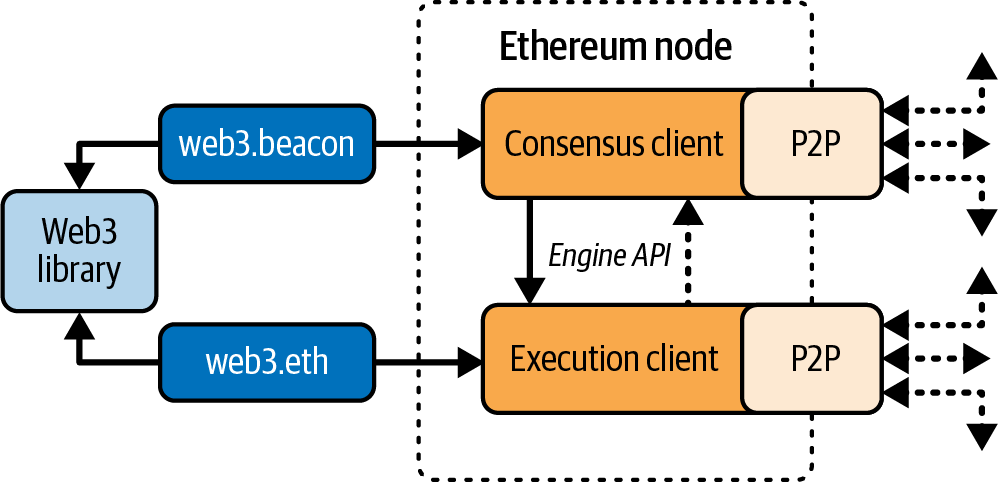

## Part 1: What an Ethereum Node Is

An Ethereum node is software that participates in the network by validating data, maintaining protocol state, and exchanging messages with peers. In modern Ethereum, a production node is composed of two cooperating clients:

- Execution client:
	- Processes transactions and smart contract execution in the EVM.
	- Maintains the execution state (accounts, balances, storage, receipts).
- Consensus client:
	- Participates in Proof-of-Stake consensus.
	- Tracks slots, epochs, attestations, and block finality.

Both layers communicate through authenticated APIs (Engine API) to keep execution and consensus synchronized.

Real-time overview of nodes in the Ethereum network: [Map of node](https://etherscan.io/nodetracker)

## Part 2: Node Types and Responsibilities

### 1. Full Node - Focused on current state

- Verifies blocks and transactions against consensus and execution rules.
- Serves chain data to local applications through JSON-RPC.
- Usually stores recent state and enough history for common wallet and dApp queries.

The way for running your own node: [run-a-node](https://ethereum.org/developers/docs/nodes-and-clients/run-a-node/)

### 2. Archive Node - Full historical state from genesis

- Preserves full historical state at every block.
- Supports deep historical queries and advanced analytics.
- Requires substantially more storage and operational cost than a standard full node.

### 3. Light Node - Summary state and header verification

- Verifies data independently: Downloads only block headers and verifies received data against state roots without downloading entire blocks.
- Minimizes hardware barriers: Lowers storage and bandwidth requirements, enabling future compatibility with mobile phones and embedded devices.
- Relies on the network for details: Requests specific blockchain data from full nodes while maintaining security guarantees, though it cannot participate in consensus.

### Remote Client - Wallet - [wallet](/ethereum/eth-wallet)

Remote clients provide a subset of full-node functionality. Because they do not store the complete blockchain state, they are faster to set up and require significantly less storage.

In practice, remote clients usually support one or more of the following capabilities:

- Managing private keys and Ethereum addresses through a wallet interface
- Creating, signing, and broadcasting transactions
- Interacting with smart contracts through transaction data payloads
- Browsing and interacting with decentralized applications (dApps)
- Linking to external services such as block explorers
- Converting ether units and retrieving market data from external providers
- Injecting a Web3 provider into the browser as a JavaScript object
- Using a Web3 provider injected by another wallet or client
- **Connecting to RPC endpoints on local or remote Ethereum nodes**

## Part 3: Client Stack in Practice

As of June 2025, there are five main implementations of the Ethereum execution protocol, written in four different languages, and five implementations of the Ethereum consensus protocol, written in five different languages:

The **execution** clients are:
  
- Geth, written in Go
- Nethermind, written in C#
- Besu, written in Java
- Erigon, written in Go
- Reth, written in Rust

The **consensus** clients are:
  
- Lighthouse, written in Rust
- Lodestar, written in TypeScript
- Nimbus, written in Nim
- Prysm, written in Go
- Teku, written in Java

You can combine any supported execution and consensus clients to run an Ethereum node.

## Part 4: Operational Considerations

- Hardware and storage:
	- NVMe SSDs are strongly recommended for stable sync and query performance.
	- Archive workloads require significantly larger storage planning.
- Networking:
	- Stable bandwidth and low packet loss improve peer quality and sync reliability.
	- Proper firewall rules are required for peer discovery and traffic.
- Security:
	- Keep validator keys isolated and never expose signing services publicly.
	- Restrict RPC endpoints with authentication, allowlists, and rate limits.
- Observability:
	- Monitor sync status, peer count, head distance, missed attestations, and disk pressure.

## Part 5: Common Deployment Patterns

- Local development node:
	- Fast setup for contract testing and RPC experiments.
- Self-hosted production node:
	- Greater control and privacy for wallets, exchanges, and protocol teams.
- Managed node providers:
	- Faster onboarding with less operational overhead, but less infrastructure control.

## Part 6: Summary

Ethereum nodes are the trust boundary between applications and the chain. Understanding client roles, node types, and operational constraints is essential for building reliable infrastructure.

In the future, new types of Ethereum clients will be available since the research and development around Ethereum is huge. Interesting areas include:

- History pruning - Prune historical data to lower the storage requirement for a full node
- Verkle trees and statelessness - Be able to verify a block without having the full Ethereum state
- zk-EVM - Verify the correctness of a block by verifying a zero-knowledge proof without having to reexecute all the transactions in the block

Next step: [eth-p2p](/ethereum/eth-p2p/)
