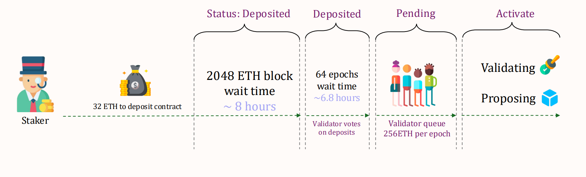
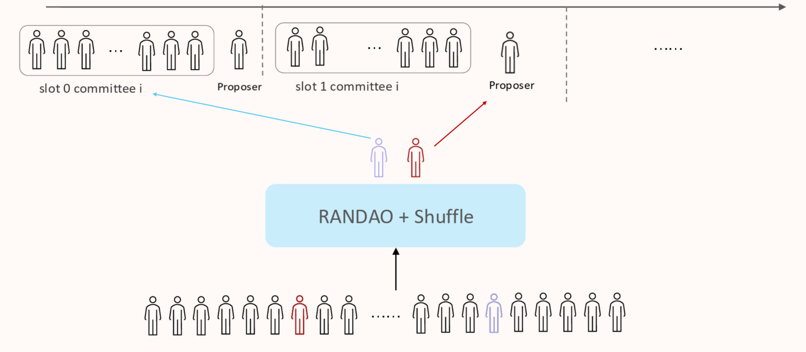

This note covers PoS from first principles to Ethereum's post-Merge implementation, including validator onboarding, randomness, voting/finality, slashing, and alternative selection models.

## Part 1: Introduction to Proof of Stake

### 1. Why PoS Exists

PoS was introduced to reduce the high energy cost of Proof of Work (PoW), where miners compete with hardware and electricity.

### 2. Core Concept

Instead of selecting block producers by computational work, PoS selects participants based on stake and protocol randomness.

### 3. Terminology

- In PoS literature, blocks may be described as forged or minted (rather than mined).
- Participants are validators (also called forgers in some networks).
- Ethereum terminology primarily uses proposer and validator/attester roles; "mining" is not used post-Merge.

## Part 2: Ethereum Beacon Chain and Validator Onboarding

### 1. Beacon Chain Role

- The Consensus Layer (Beacon Chain logic) coordinates validator registry, committees, attestations, and finality.
- Execution of smart contracts and user transactions remains in the Execution Layer.

### 2. Becoming a Validator

- A participant deposits **at least 32 ETH** to activate a validator identity.
- Deposit data includes BLS public key material and withdrawal credentials.
- After deposit recognition, the validator moves through queue states before becoming active.

Post-Pectra (Prague-Electra) note:

- Via **EIP-7251 (MaxEB)**, validator effective balance can scale above 32 ETH up to **2,048 ETH**.
- This enables stake consolidation and consensus-layer reward compounding within the expanded effective-balance range.

### 3. Lifecycle (Simplified)

- Deposited: deposit accepted and queued for activation pipeline.
- Pending: waiting for activation based on churn limits and network conditions.
- Active: assigned committees and eligible for **proposing/attesting**.

Operational notes:

- Queue waiting time is dynamic and can vary significantly with validator churn.
- Via **EIP-6110**, deposit data is sourced from execution-layer blocks, reducing deposit processing latency before activation-queue effects.
- Via **EIP-7002** (on networks where activated), execution-layer triggered withdrawal/exit flows are supported, reducing dependence on operator-pre-signed exit coordination.

## Part 3: Overview



## Part 4: Committees and RANDAO

### 1. Committees

- Validators are shuffled into committees for attestation duties.
- During an epoch, active validators are assigned to committees by protocol randomness.
- Ethereum defines a target committee size (commonly referenced as 128), but realized committee sizes can vary with active validator count and protocol limits.

### 2. RANDAO Randomness Pipeline

- Proposers include a `randao_reveal` in blocks.
- Reveals are mixed into the protocol randomness accumulator.
- The resulting randomness is used to assign future proposers and committees.



Why this matters:
- Reduces duty predictability.
- Improves fairness of assignments.
- Raises the difficulty of targeted manipulation.

## Part 5: Proposal, Voting, and BLS Aggregation

### 1. Block Proposal

- For each slot, one proposer is randomly selected.
- In modern Ethereum operations, out-of-protocol proposer-builder separation ecosystems can provide payloads, while the proposer still publishes the beacon block.

### 2. Attestation Voting

- Committee validators attest to block correctness and fork-choice head.
- Safety thresholds are stake-weighted, not simple validator counts.
- Finality logic relies on supermajority voting behavior over checkpoints.

At the slot level, one validator proposes a block and the committee votes by submitting attestations. A typical attestation includes:

- The attestation `slot` and `committee index`.
- The `beacon_block_root` for the head being voted.
- The **target** checkpoint (current epoch checkpoint vote).
- The **source** checkpoint (previous justified checkpoint reference).
- The validator's signature proving the vote came from that validator.

### 3. BLS Aggregation

- Individual attestations are compressed via BLS aggregation.
- Aggregation reduces bandwidth and verification overhead.
- This scaling mechanism is essential for large validator sets.

## Part 6: Security Model, Nothing-at-Stake, and Slashing

### 1. Nothing-at-Stake Risk (Conceptual)

Early PoS discussions highlighted a risk where validators might sign competing forks without physical mining cost.

### 2. Ethereum Mitigation: Slashing

Ethereum penalizes slashable behavior such as:

- Double proposal for the same slot.
- Double vote (conflicting attestations).
- Surround vote patterns.

### 3. Penalty Effects (High Level)

- Forced exit from active duties.
- Initial slash penalties and correlated penalties are protocol-parameterized and can change across hard forks.
- Full withdrawability timing depends on exit queue and withdrawability delay; it is not a single fixed wall-clock constant.

Exact penalty size depends on protocol rules and surrounding slash events.

## Part 7: Rewards and Finality

### 1. Reward Logic

- Rewards are tied to validator effective balance and total active stake.
- Proposer and attester rewards are separate components.
- Additional incentives can exist for including slash evidence.

Common base-reward study formula form:

$$
BaseReward = \frac{EffectiveBalance \times BASE\_REWARD\_FACTOR}{\sqrt{TotalActiveBalance} \times BASE\_REWARDS\_PER\_EPOCH}
$$

On mainnet constants this is commonly expressed as:

$$
BaseReward = \frac{EffectiveBalance \times 64}{\sqrt{TotalActiveBalance} \times 4}
$$

Post-Pectra interpretation:

- `EffectiveBalance` is no longer a universal fixed 32 ETH assumption in all cases.
- Per-validator effective balance can vary (up to MaxEB bounds), so worked examples should explicitly state assumptions.

Reward split intuition:

- Proposer can receive about **1/8** share of attestation-related base reward components they include.
- Attesters can receive up to about **7/8** of base reward-related components when duties are correctly performed.

Note: exact production-client accounting includes additional constants, penalties, and timing factors.

### 2. Worked Reward Example (Study Format)

The following is a simplified exam-style walkthrough using common lecture assumptions.

#### A) Base Reward Example

Assume:

- Active validators = 600,000
- Effective balance per validator (example assumption) = 32 ETH = 32 * 10^9 gwei

Formula:

$$
BaseReward = \frac{EffectiveBalance \times 64}{\sqrt{TotalActiveBalance} \times 4}
$$

With:

$$
TotalActiveBalance = 600,000 \times 32 \times 10^9\ gwei
$$

So a commonly cited simplified result is:

$$
BaseReward \approx 3,695\ gwei
$$

Assumption note: this numeric result depends on the 32 ETH-per-validator simplification and is a study example, not a universal post-Pectra constant.

#### B) Proposer Reward Example

For included valid attestations, a proposer receives approximately:

$$
ProposerShare \approx attestations  \times \frac{1}{8} \times BaseReward
$$

If expected attestations per slot are approximated as:

(Here, `600,000 / 32` uses active validator count per epoch-slot distribution. This is not derived from dividing total active stake by 32 ETH.)

$$
\frac{600,000}{32} = 18,750
$$

Then a simplified estimate is:

$$
ProposerReward \approx 18,750 \times \frac{1}{8} \times 3,695 = 8,660,156\ gwei
$$

Depending on lecture constants/rounding assumptions, you may also see nearby values.

#### C) Attester (Validator) Reward Example

A non-proposer validator performing attestation duties can receive up to approximately:

$$
AttesterReward_{max} \approx \frac{7}{8} \times BaseReward + \frac{priority fee}{validators}
$$

Using the same base reward:

$$
AttesterReward_{max} \approx \frac{7}{8} \times 3,695 + \frac{0.05}{600,000} = 3,233.125\ gwei
$$

#### D) Slashing-Inclusion Reward (Proposer)

If a proposer includes valid slash evidence, a simplified study form is:

$$
SlashingInclusionReward = \frac{SlashedValidatorsEffectiveBalance}{512}
$$

This component is separate from ordinary proposer/attester reward shares.

### 3. Finality

- Finality is achieved through checkpoint justification/finalization across epochs.
- Under normal conditions, economic finality is commonly reached after about **2 epochs (around 12.8 minutes)**.

Algorithms used in Ethereum PoS:

- **Casper FFG:** checkpoint justification/finalization mechanism across epochs.
- **LMD-GHOST:** fork-choice rule used to determine the current chain head before and between finality events.

Engine API coordination note:

- CL fork-choice updates are communicated to EL via Engine API (for example forkchoice-updated flows) so payload building/validation tracks the CL-selected head.

## Part 8: Alternative Selection Model - Coin Age

Some PoS-family systems use coin age to balance pure wealth-based selection.

- Coin age concept: staked amount multiplied by staking duration.
- Representative form:

$$
CoinAge = Coins \times DaysStaked
$$

- Selection probability can be adjusted by coin age (for example, increasing chance with age).
- After successful block signing, coin age may reset.
- Some designs cap effective age to prevent very old stakes from dominating.

## Part 9: Slot-Level PoS Flow

```text
[RANDAO updates randomness]
        -> [Proposer and committees assigned]
        -> [Block proposal in slot]
        -> [Committee attestations]
        -> [Fork choice head update]
        -> [Checkpoint justification/finality across epochs]
```
