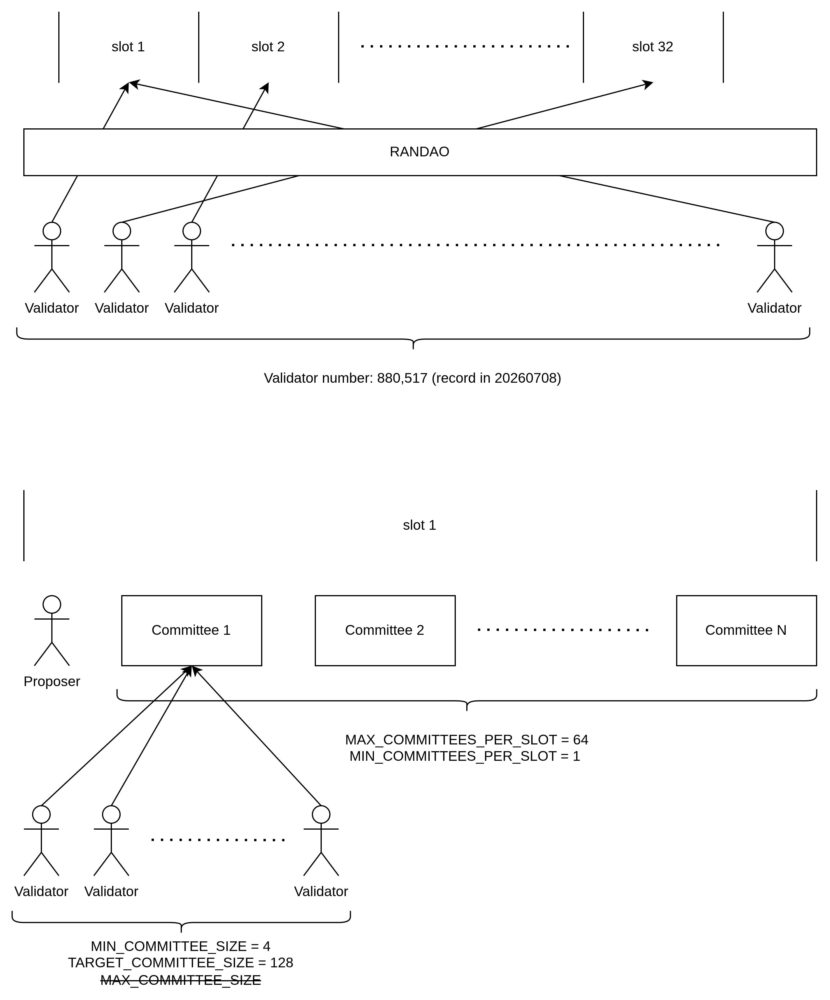

This note covers PoS from first principles to Ethereum's post-Merge implementation, including validator onboarding, randomness, voting/finality, slashing, and alternative selection models.

## Part 1: Introduction to Proof of Stake

### 1. Why PoS Exists

PoS was introduced to reduce the high energy cost of Proof of Work (PoW), where miners compete with hardware and electricity.

### 2. Core Concept

Instead of selecting block producers by computational work, PoS selects participants based on stake and protocol randomness.

### 3. Terminology

- In PoS literature, blocks may be described as forged or minted (rather than mined).
- Participants are validators (also called forgers in some networks).
- Ethereum terminology primarily uses proposer and validator/attester roles; "mining" is not used post-Merge.

## Part 2: Ethereum Beacon Chain and Validator Onboarding

### 1. Beacon Chain Role

- The Consensus Layer (Beacon Chain logic) coordinates validator registry, committees, attestations, and finality.
- Execution of smart contracts and user transactions remains in the Execution Layer.

### 2. Becoming a Validator

- A participant deposits **at least 32 ETH** to activate a validator identity.
- Deposit data includes BLS public key material and withdrawal credentials.
- After deposit recognition, the validator moves through queue states before becoming active.

Important clarification:

- Holding **32 ETH** in a wallet does **not** automatically convert that wallet into a validator.
- A validator is created only after explicit key-generation and deposit-contract onboarding steps are completed.

Manual activation workflow for the native 32 ETH path:

1. **Prepare hardware and clients.** Set up a machine suitable for continuous operation, then install and sync one execution client and one consensus client. A common operator baseline example is fast NVMe storage, sufficient RAM, and stable broadband, but exact hardware guidance should be taken from current staking guides.
2. **Generate validator credentials.** Use the staking deposit tooling to generate validator key material and withdrawal credentials. Keep recovery material and withdrawal control separated from day-to-day online operations.
3. **Load signing keys into validator operations.** Import validator signing keys into your validator client or remote signer, and enable slashing protection.
4. **Submit deposit data and deposit transaction.** Upload `deposit_data` through the **Launchpad-guided** flow and send the one-way deposit transaction on Ethereum mainnet to the official deposit contract.
5. **Wait for activation and operate continuously.** After recognition, the validator enters queue-based activation, then becomes eligible for duties only when active.

Post-Pectra (Prague-Electra) note:

- Via **EIP-7251 (MaxEB)**, validator effective balance can scale above 32 ETH up to **2,048 ETH**.
- This enables stake consolidation and consensus-layer reward compounding within the expanded effective-balance range.

### 3. Lifecycle (Simplified)

- Deposited: deposit accepted and queued for activation pipeline.
- Pending: waiting for activation based on churn limits and network conditions.
- Active: assigned committees and eligible for **proposing/attesting**.

Operational notes:

- Queue waiting time is dynamic and can vary significantly with validator churn.
- Via **EIP-6110**, deposit data is sourced from execution-layer blocks, reducing deposit processing latency before activation-queue effects.
- Via **EIP-7002** (on networks where activated), execution-layer triggered withdrawal/exit flows are supported, reducing dependence on operator-pre-signed exit coordination.


## Part 3: Technical breakdown

### 3.1: Full Node vs Validator

#### 1. Different Roles in the Stack

A validator is not the same thing as a full node.

- A full Ethereum PoS stack usually includes an **execution client (EL)** that verifies transactions, executes EVM payloads, maintains execution state, and validates execution-layer data.
- The same stack also includes a **consensus client (CL)** that tracks beacon-chain state, fork choice, committees, attestations, finality, and beacon-block validity.
- A **validator client (VC)** is the component that holds validator signing keys and performs validator duties such as block proposals, attestations, and sync-committee messages when applicable.

#### 2. What the Validator Depends On

It is misleading to describe a validator as a signer that operates independently of node software.

- Validators do **not** directly execute execution-layer transactions by themselves.
- However, validator duties depend on EL and CL software that is continuously validating execution payloads, validating beacon blocks, tracking the current fork-choice head, computing duty schedules, and preparing the exact data the validator client is allowed to sign.

In practice, validator signatures are meaningful only because the surrounding node stack has already validated enough state to make that duty current and valid.

#### 3. Private Key Isolation

Operationally, key separation matters.

- The **validator signing key** is a hot key used for recurring consensus duties.
- The **withdrawal credential** is logically distinct and should be protected more conservatively.
- Many operators isolate signing through a separate validator client, a remote signer, hardware-backed signing, and strict slashing-protection databases with controlled failover.

The core safety goal is to avoid the same validator key signing conflicting duties from multiple active instances.

#### 4. One Infrastructure Stack, Many Validators

A validator is an on-chain identity, not a requirement for a dedicated EL/CL pair.

- One execution client and one consensus client can support **many validator keys**.
- Larger operators often run shared EL/CL infrastructure, one or more validator clients, external signing services, and redundant node paths with careful failover logic.

What must be controlled is not "one node per validator" but:

- key custody;
- slashing protection;
- consistency of chain view during failover;
- safe duty handoff between active and standby systems.

### 3.2: Participation Paths by Stake Size

#### 1. Less Than 32 ETH

A balance below **32 ETH** cannot directly activate a native validator index because the protocol minimum activation balance remains **32 ETH**.

For a dedicated comparison of liquid staking, exchange staking, and reduced-bond operator models, see [Staking with Less Than 32 ETH](/ethereum/eth-stakepooling/).

Common participation paths:

- **Pooled staking** combines capital from multiple users so an operator or protocol can run validators. Tradeoff: lower capital barrier, but additional trust, governance, or smart-contract assumptions.
- **Liquid staking** issues a tokenized claim on staked ETH plus accrued rewards. Tradeoff: adds smart-contract risk, liquidity-token market risk, and possible validator-set concentration risk.
- **Custodial or delegated staking** lets an exchange or service stake on the user's behalf. Tradeoff: simplest user experience, but weaker self-custody and greater counterparty dependence.

#### 2. Exactly 32 ETH

At **32 ETH**, a user can operate one validator directly.

Main participation models:

- **Solo staking** means the staker runs their own EL, CL, and validator setup. Tradeoff: highest operational responsibility, but strongest control and cleanest trust model.
- **Staking-as-a-service / delegated operation** means the staker funds the validator but outsources some or all infrastructure operations. Tradeoff: lower operational burden, but added operator trust and dependency.
- **Custodial arrangements** mean a provider controls more of the key or infrastructure stack. Tradeoff: easier access, but weaker self-custody and larger counterparty exposure.

In practice, the critical questions are who controls:

- signing keys;
- withdrawal credentials;
- exit coordination;
- recovery during outages or key loss.

#### 3. More Than 32 ETH

For balances above **32 ETH**, the participation model depends on protocol era and operator goals.

Pre-Pectra intuition:

- Additional stake was usually split into multiple **32 ETH validator indices**.
- Example: 64 ETH -> 2 validators; 96 ETH -> 3 validators.

Post-Pectra / **EIP-7251** nuance:

- The old "every additional 32 ETH means one more validator" model is no longer the only native pattern.
- Effective balance can scale above 32 ETH, up to the protocol maximum, allowing larger effective balances per validator, reward compounding within the expanded effective-balance range, and consolidation of multiple validator positions into fewer validator indices where supported.

Tradeoffs for larger positions:

- **More validator indices** provide finer operational granularity, but require more keys, more duties, and more signing overhead.
- **Fewer, larger validator balances** reduce validator-count overhead and can simplify fleet management, but change the concentration and operational-risk profile per validator index.

#### 4. Practical Trust and Operations Summary

- **Solo staking** offers the lowest trust in third parties, but the highest operational responsibility.
- **Non-custodial pooled or liquid systems** lower the capital barrier, but add smart-contract, governance, and concentration risks.
- **Delegated or staking-as-a-service models** improve convenience for 32 ETH holders, but shift trust toward the operator's uptime, security, and signing discipline.
- **Custodial exchange staking** has the lowest operational burden, but the highest counterparty and custody dependence.

## Part 4: Committees and RANDAO



### 1. Committees
- Active validators are pseudo-randomly shuffled using protocol randomness (RANDAO-based inputs).
- For each slot, **one proposer** is selected.
- Validators are shuffled into committees for attestation duties.
- During an epoch, active validators are assigned to committees by protocol randomness.
- Ethereum defines a target committee size (commonly referenced as 128), but realized committee sizes can vary with active validator count and protocol limits.

#### Committee Count Restriction Formula

The actual number of committees per slot is dynamically computed from the active validator set.

In study form:

$$
	ext{CommitteesPerSlot} = \max\left(1,\min\left(64,\left\lfloor\frac{\text{ActiveValidators}}{32 \times 128}\right\rfloor\right)\right)
$$

Equivalent protocol-style form:

$$
	ext{CommitteesPerSlot} = \max\left(1,\min\left(\text{MAX\_COMMITTEES\_PER\_SLOT},\frac{\text{ActiveValidators}}{\text{SLOTS\_PER\_EPOCH}\times\text{TARGET\_COMMITTEE\_SIZE}}\right)\right)
$$

where the division is integer division under protocol rules.

#### Calculation Logic for Committee Size

When active validators exceed 262,144, committees per slot reach the protocol cap of 64:

$$
32 \times 128 \times 64 = 262,144
$$

After this point, committee count no longer increases; additional validators are spread across existing committees.

1. Total committees per epoch at cap:

$$
32\ \text{slots} \times 64\ \text{committees/slot} = 2,048\ \text{committees/epoch}
$$

2. Validators are pseudo-randomly distributed across these epoch committees so each active validator receives attestation duties according to its assignment.

#### Simulation Examples

Approximate average committee size can be estimated as:

$$
	ext{AvgCommitteeSize} \approx \frac{\text{ActiveValidators}}{2,048}
$$

- With about 900,000 active validators:

$$
\frac{900,000}{2,048} \approx 439
$$

- With about 1,000,000 active validators:

$$
\frac{1,000,000}{2,048} \approx 488
$$

These are averages; realized committee sizes vary slightly because assignment is discrete and randomized.


### 2. RANDAO Randomness Pipeline

- Proposers include a `randao_reveal` in blocks.
- Reveals are mixed into the protocol randomness accumulator.
- The resulting randomness is used to assign future proposers and committees.

Why this matters:
- Reduces duty predictability.
- Improves fairness of assignments.
- Raises the difficulty of targeted manipulation.

## Part 5: Proposal, Voting, and BLS Aggregation

### 1. Block Proposal

- For each slot, one proposer is randomly selected.
- In modern Ethereum operations, out-of-protocol proposer-builder separation ecosystems can provide payloads, while the proposer still publishes the beacon block.

### 2. Attestation Voting

- Committee validators attest to block correctness and fork-choice head.
- Safety thresholds are stake-weighted, not simple validator counts.
- Finality logic relies on supermajority voting behavior over checkpoints.

At the slot level, one validator proposes a block and the committee votes by submitting attestations. A typical attestation includes:

- The attestation `slot` and `committee index`.
- The `beacon_block_root` for the head being voted.
- The **target** checkpoint (current epoch checkpoint vote).
- The **source** checkpoint (previous justified checkpoint reference).
- The validator's signature proving the vote came from that validator.

### 3. BLS Aggregation

- Individual attestations are compressed via BLS aggregation.
- Aggregation reduces bandwidth and verification overhead.
- This scaling mechanism is essential for large validator sets.

## Part 5A: Slot Timing and Cross-Slot Handoff

### 1. Time Units

Ethereum PoS runs on a fixed clock.

- **1 slot = 12 seconds**
- **1 epoch = 32 slots**
- Therefore, **1 epoch = 384 seconds = 6.4 minutes**

For each slot:

- one proposer is selected;
- committees are assigned to attest;
- some committee members may be selected as aggregators.

### 2. Practical In-Slot Timeline

A useful operator-facing mental model is:

- **0-4 seconds: proposal and propagation.** The proposer for slot `t` should publish the beacon block as early as possible. That block carries the execution payload and any eligible consensus operations available at that time, and peers begin propagating it across the consensus p2p network.
- **4-8 seconds: attestation production.** Committee members receive the block, validate it, update fork choice, and produce attestations. These attestations are gossiped on relevant committee subnets rather than to every validator globally. If a validator does not see a timely valid block for slot `t`, it can still attest to its best available fork-choice head.
- **8-12 seconds: aggregation and next-slot preparation.** Selected aggregators collect committee attestations and produce aggregate attestations. Aggregates are rebroadcast so later proposers can include them efficiently. By the end of the slot, the network is converging on the head that the next proposer will likely build on.

This is an operational timing model, not a claim that all honest nodes receive messages at exactly the same moment.

### 3. How Slot `t+1` Builds on Slot `t`

Slots are not isolated; each slot hands state and information to the next one.

- The proposer of slot `t+1` chooses a parent according to fork choice, which reflects whatever valid block and attestations from slot `t` arrived in time.
- The block in slot `t+1` can include attestations and aggregates produced in or after slot `t`.
- In practice, the **parent choice** for slot `t+1` is strongly influenced by slot-`t` attestations, and the **block body** of slot `t+1` often contains votes about slot `t`.

The chain therefore advances by a repeated pattern:

- propose at slot `t`;
- attest to what was seen in slot `t`;
- aggregate those attestations;
- use that voting information to strengthen fork choice for slot `t+1`.

### 4. Missed and Late Slots

A **missed slot** means no valid beacon block becomes available for that slot.

- There is no new block at that slot number.
- The next proposer builds on the latest valid head from an earlier slot.
- Later attestations can still move fork choice and finality forward if enough stake continues to vote correctly.

A **late slot** is more subtle.

- The block can still be valid.
- But many attesters may already have failed to receive it in time or may have attested to an earlier head.
- Consequences can include fewer timely attestations, weaker immediate fork-choice support, and worse proposer and attester economics for that slot.

### 5. Why Aggregation Timing Matters

Aggregation is not just a bandwidth optimization.

- Individual attestations first spread within committee-specific gossip paths.
- Aggregators compress them into aggregate attestations.
- Later proposers include these aggregates on-chain, which improves fork-choice weight visibility and reward accounting efficiency.

### 6. Proposer Selection Probability

Proposer selection is **stake-weighted through effective balance**, not simply one validator index equals one equal chance.

- Under older simplified explanations, validators were often treated as if they all had the same effective balance cap of **32 ETH**, so proposer odds looked roughly equal per validator index.
- More precisely, proposer selection probability is weighted by a validator's **effective balance** under the active protocol rules.
- Post-Pectra, that simplification is less complete because effective-balance rules are no longer universally pinned to the old 32 ETH cap assumptions.

## Part 6: Security Model, Nothing-at-Stake, and Slashing

### 1. Nothing-at-Stake Risk (Conceptual)

Early PoS discussions highlighted a risk where validators might sign competing forks without physical mining cost, as doing so on multiple chains is computationally trivial.

### 2. Ethereum Mitigation: Slashing

Ethereum uses **slashing** to penalize severe, protocol-threatening behavior. Ordinary offline status (e.g., due to power outages or network failure) does not trigger slashing; it only incurs small inactivity penalties. 

Slashing is reserved exclusively for three specific consensus-breaking offenses:

#### A) Double Proposing
- **Definition:** A block proposer signs and broadcasts two different blocks for the same slot.
- **Hazard:** This is an attempt to split the network and force a chain fork.
- **Common Cause:** Usually occurs due to malicious intent or operator configuration error (running the same validator key on two active backup nodes simultaneously).

#### B) LMD-GHOST Double Voting (Attestation Double Voting)
- **Definition:** An attester signs and submits two different attestation votes (witnesses) for two different blocks in the same slot.
- **Hazard:** Contributing votes to conflicting chain heads to destabilize the consensus fork-choice rule.
- **Common Cause:** Customer software bugs or key backup misconfiguration.

#### C) FFG Surrounding Voting (Casper FFG Surrounding)
- **Definition:** A validator publishes a new attestation vote whose source and target checkpoints completely "surrounds" or "encompasses" a previous attestation vote they signed. For example, if an earlier vote is from checkpoint $A \to B$ and a newer vote is from $A_{prev} \to B_{post}$, this is a surround vote.
- **Hazard:** This violates the finality rules of Casper FFG, attempting to rewrite finality history.

---

### 3. Validator and Proposer Penalties

Penalties are split into **Slashing (Malicious)** and **Non-Slashing (Unintentional Offline)** duties.

#### Ethereum Penalty Structure 

| Category / Role                                      | Specific Event / Offense                                       | Penalty Consequences & Mechanics                                                                                                                                                                                                                                                                                                                                                                                                                                                                                                                                                                                                                                    |
| :--------------------------------------------------- | :------------------------------------------------------------- | :------------------------------------------------------------------------------------------------------------------------------------------------------------------------------------------------------------------------------------------------------------------------------------------------------------------------------------------------------------------------------------------------------------------------------------------------------------------------------------------------------------------------------------------------------------------------------------------------------------------------------------------------------------------ |
| **Slashing (Malicious)**<br>*(Proposer & Validator)* | **Double Proposing** / **Double Voting** / **Surround Voting** | **1. Initial Penalty:** Immediate deduction of at least 1 ETH from the validator's balance.<br>**2. Correlation Penalty:** Mid-term penalty calculated over a ~36-day period (18 days before and after the slash). If only a single isolated node is slashed, the penalty is minor. If deep, correlated group attacks occur (e.g., $> 1/3$ of validators slash concurrently), the penalty scales linearly up to the entire stake (32 ETH).<br>**3. Forced Exit & Offline Loss:** Slashed validators are immediately queued for forced exit (~36 days). During this period, they are inactive and continually accumulate offline penalties (approx. 0.18 ETH total). |
| **Non-Slashing (Offline)**<br>*(Proposer)*           | **Missed Slot (Downtime Proposer)**                            | **Missed Slot Penalty:** No direct asset deduction is taken from the existing stake. However, the validator misses out on all potential yields for that block (block proposal rewards, execution priority fees, and MEV opportunities).                                                                                                                                                                                                                                                                                                                                                                                                                             |
| **Non-Slashing (Offline)**<br>*(Validator)*          | **Standard Offline / Downtime**                                | **Offline Penalty:** minor fee matching the validator's normal online reward rate (typically equivalent to earning rate, e.g., $\sim 0.003$ ETH per day) as long as $> 2/3$ of the active set is online.                                                                                                                                                                                                                                                                                                                                                                                                                                                            |
| **Non-Slashing (Offline)**<br>*(Validator)*          | **Catastrophic Offline (Inactivity Leak)**                     | **Inactivity Leak Penalty:** Triggered when $> 1/3$ of total validators go offline (preventing chain finalization). Offline nodes suffer exponential balance decay until their balance drops below 16 ETH and they are forced off-chain, restoring the online validator supermajority ($2/3$) required for finality.                                                                                                                                                                                                                                                                                                                                                |

## Part 7: Rewards and Finality

### 1. Reward Logic

- Rewards are tied to validator effective balance and total active stake.
- Proposer and attester rewards are separate components.
- Additional incentives can exist for including slash evidence.

Common base-reward study formula form:

$$
BaseReward = \frac{EffectiveBalance \times BASE\_REWARD\_FACTOR}{\sqrt{TotalActiveBalance} \times BASE\_REWARDS\_PER\_EPOCH}
$$

On mainnet constants this is commonly expressed as:

$$
BaseReward = \frac{EffectiveBalance \times 64}{\sqrt{TotalActiveBalance} \times 4}
$$

Post-Pectra interpretation:

- `EffectiveBalance` is no longer a universal fixed 32 ETH assumption in all cases.
- Per-validator effective balance can vary (up to MaxEB bounds), so worked examples should explicitly state assumptions.

Reward split intuition:

- Proposer can receive about **1/8** share of attestation-related base reward components they include.
- Attesters can receive up to about **7/8** of base reward-related components when duties are correctly performed.

Note: exact production-client accounting includes additional constants, penalties, and timing factors.

### 2. Worked Reward Example (Study Format)

The following is a simplified exam-style walkthrough using common lecture assumptions.

#### A) Base Reward Example

Assume:

- Active validators = 600,000
- Effective balance per validator (example assumption) = 32 ETH = 32 * 10^9 gwei

Formula:

$$
BaseReward = \frac{EffectiveBalance \times 64}{\sqrt{TotalActiveBalance} \times 4}
$$

With:

$$
TotalActiveBalance = 600,000 \times 32 \times 10^9\ gwei
$$

So a commonly cited simplified result is:

$$
BaseReward \approx 3,695\ gwei
$$

Assumption note: this numeric result depends on the 32 ETH-per-validator simplification and is a study example, not a universal post-Pectra constant.

#### B) Proposer Reward Example

For included valid attestations, a proposer receives approximately:

$$
ProposerShare \approx attestations  \times \frac{1}{8} \times BaseReward
$$

If expected attestations per slot are approximated as:

(Here, `600,000 / 32` uses active validator count per epoch-slot distribution. This is not derived from dividing total active stake by 32 ETH.)

$$
\frac{600,000}{32} = 18,750
$$

Then a simplified estimate is:

$$
ProposerReward \approx 18,750 \times \frac{1}{8} \times 3,695 = 8,660,156\ gwei
$$

Depending on lecture constants/rounding assumptions, you may also see nearby values.

#### C) Attester (Validator) Reward Example

A non-proposer validator performing attestation duties can receive up to approximately:

$$
AttesterReward_{max} \approx \frac{7}{8} \times BaseReward + \frac{priority fee}{validators}
$$

Using the same base reward:

$$
AttesterReward_{max} \approx \frac{7}{8} \times 3,695 + \frac{0.05}{600,000} = 3,233.125\ gwei
$$


#### D) Slashing-Inclusion Reward (Proposer)

If a block proposer includes valid slash evidence in a block, they are compensated by the protocol for helping maintain network security. 

This is known as the **Slashing Inclusion Reward**:

$$
SlashingInclusionReward = \frac{\text{SlashedValidator's Effective Balance}}{512}
$$

##### Core Mechanism Parsing:
1. **The Proposer's Role:** Every 12 seconds (one slot), a validator is randomly assigned to produce a block. If they collect and include proof of another validator's double-signing/slashing offense (slash evidence), they package it within the block payload.
2. **The Slasher / Slashed Validator's Stake:** The penalty is calculated based on the *Effective Balance* of the offending validator being penalized.
3. **Calculation Example (Study Case):**
   - Assumed Slashed Validator Effective Balance = $32\ \text{ETH}$.
   - Reward output for the proposer:
     $$
     \text{Reward} = \frac{32\ \text{ETH}}{512} = 0.0625\ \text{ETH}
     $$

##### Key Strategic Characteristics:
- **Absolute Independence:** This reward is issued *separately* and *in addition* to standard block proposing rewards, execution fees, or attestation shares.
- **Economic Safety Incentive:** This is intentionally designed to establish a powerful, decentralized economic incentive pattern. Every operator is financially motivated to continuously monitor and report misbehaving nodes instantly, securing the network ledger on-chain.

### 3. Finality

- Finality is achieved through checkpoint justification/finalization across epochs.
- Under normal conditions, economic finality is commonly reached after about **2 epochs (around 12.8 minutes)**.

Algorithms used in Ethereum PoS:

- **Casper FFG:** checkpoint justification/finalization mechanism across epochs.
- **LMD-GHOST:** fork-choice rule used to determine the current chain head before and between finality events.

Engine API coordination note:

- CL fork-choice updates are communicated to EL via Engine API (for example forkchoice-updated flows) so payload building/validation tracks the CL-selected head.

## Part 8: Alternative Selection Model - Coin Age

Some PoS-family systems use coin age to balance pure wealth-based selection.

- Coin age concept: staked amount multiplied by staking duration.
- Representative form:

$$
CoinAge = Coins \times DaysStaked
$$

- Selection probability can be adjusted by coin age (for example, increasing chance with age).
- After successful block signing, coin age may reset.
- Some designs cap effective age to prevent very old stakes from dominating.

## Part 9: Slot-Level PoS Flow

```text
[RANDAO updates randomness]
        -> [Proposer and committees assigned]
        -> [Block proposal in slot]
        -> [Committee attestations]
        -> [Fork choice head update]
        -> [Checkpoint justification/finality across epochs]
```

## Part 10: References

- [Ethereum.org: Staking](https://ethereum.org/en/staking/)
- [Ethereum.org: Solo Staking](https://ethereum.org/en/staking/solo/)
- [Ethereum.org: Run a Node](https://ethereum.org/en/run-a-node/)
- [Ethereum.org: Staking as a Service](https://ethereum.org/en/staking/saas/)
- [Ethereum.org: Pooled Staking](https://ethereum.org/en/staking/pools/)
- [Ethereum Launchpad: Overview](https://launchpad.ethereum.org/en/overview)
- [Ethereum Launchpad: Checklist](https://launchpad.ethereum.org/en/checklist)
- [Ethereum Launchpad: FAQ](https://launchpad.ethereum.org/en/faq)
- [Ethereum.org: Proof-of-Stake](https://ethereum.org/en/developers/docs/consensus-mechanisms/pos/)
- [Ethereum.org: Attestations](https://ethereum.org/en/developers/docs/consensus-mechanisms/pos/attestations/)
- [Ethereum.org: Slots and Epochs](https://ethereum.org/en/developers/docs/consensus-mechanisms/pos/#slots-and-epochs)
- [Ethereum Staking Deposit CLI](https://github.com/ethereum/staking-deposit-cli)
- [Consensus Specs](https://github.com/ethereum/consensus-specs)
- [Annotated Consensus Specs (eth2book)](https://eth2book.info/)
- [EIP-7251: Increase the MAX_EFFECTIVE_BALANCE](https://eips.ethereum.org/EIPS/eip-7251)
- [EIP-6110: Supply Validator Deposits on Chain](https://eips.ethereum.org/EIPS/eip-6110)
- [EIP-7002: Execution Layer Triggerable Withdrawals](https://eips.ethereum.org/EIPS/eip-7002)
