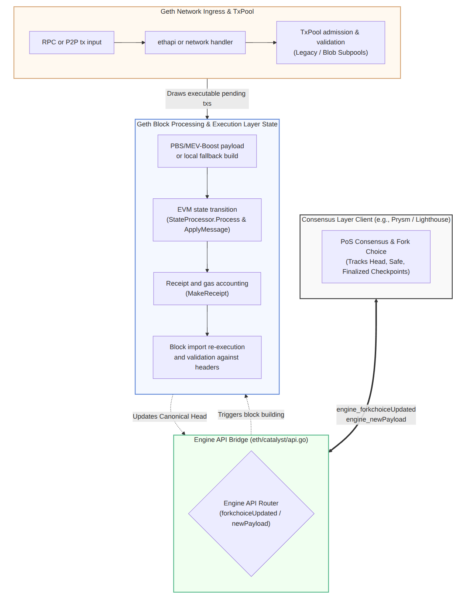

## 1. End-to-End Pipeline

The following integrated flowchart tracks the lifecycle of a transaction from node ingress to canonical-chain validation, explicitly highlighting how the Consensus Layer directs Geth's components.



How to read this pipeline:
- Goal: show the transaction's lifecycle from node ingress to canonical-chain validation.
- Data in: a signed transaction from RPC or p2p.
- Main control path: ingress handler -> txpool -> payload source -> EVM execution -> block import validation.
- Data out: either rejection/queueing in the pool, or a receipt/log set attached to an accepted block.

The important distinction is that txpool acceptance is not final chain acceptance. A transaction can enter the pool, wait as queued/pending data, be skipped by payload selection, and still only become canonical after block execution and import validation succeed.

---

## 2. Transaction Submission and Verification

### 2.1 Local RPC ingress
- Goal: turn user input into a signed `types.Transaction` and hand it to the pool.
- Data in: JSON-RPC transaction arguments or raw signed transaction bytes.
- Control path: RPC API validates/fills fields, constructs/decodes the transaction, then submits it through the backend.
- Data out: transaction hash on successful submission, or an error before/inside pool insertion.


For signed-by-node submission:
- Entry is `TransactionAPI.SendTransaction` in `internal/ethapi/api.go:1674`.
- It fills defaults (`nonce`, `gas`, fee fields, chain ID), builds a typed transaction, signs it via wallet, and submits it.
- Operational note: many public RPC providers disable `eth_sendTransaction` because they do not manage user private keys server-side.

For pre-signed raw submission:
- Entry is `TransactionAPI.SendRawTransaction` in `internal/ethapi/api.go:1738`.
- It decodes raw bytes into `types.Transaction` and submits it.

Both paths converge through:
- `SubmitTransaction` in `internal/ethapi/api.go:1640`.
- Backend insertion via `EthAPIBackend.SendTx` in `eth/api_backend.go:342`.
- Txpool insertion through `txPool.Add`.

Concrete call/data path:
- `SendTransaction` path: `args.setDefaults` -> `args.ToTransaction` -> `wallet.SignTx` -> `SubmitTransaction` -> `EthAPIBackend.SendTx` -> `txPool.Add`.
- `SendRawTransaction` path: `tx.UnmarshalBinary` -> (optional blob sidecar version conversion) -> `SubmitTransaction` -> `EthAPIBackend.SendTx` -> `txPool.Add`.
- `EthAPIBackend.SendTx` behavior: returns immediate pool errors for permanent rejection; temporary rejection can still be tracked for local resubmission when local tx tracking is enabled.

Code snippet:

```go
// internal/ethapi/api.go
func (api *TransactionAPI) SendTransaction(ctx context.Context, args TransactionArgs) (common.Hash, error) {
    if err := args.setDefaults(ctx, api.b, sidecarConfig{}); err != nil { return common.Hash{}, err }
    tx := args.ToTransaction(types.DynamicFeeTxType)
    signed, err := wallet.SignTx(account, tx, api.b.ChainConfig().ChainID)
    if err != nil { return common.Hash{}, err }
    return SubmitTransaction(ctx, api.b, signed)
}

func (api *TransactionAPI) SendRawTransaction(ctx context.Context, input hexutil.Bytes) (common.Hash, error) {
    tx := new(types.Transaction)
    if err := tx.UnmarshalBinary(input); err != nil { return common.Hash{}, err }
    return SubmitTransaction(ctx, api.b, tx)
}
```

### 2.2 Admission checks before pending state
- Goal: decide whether the node can store and potentially execute the transaction later.
- Data in: signed `types.Transaction` plus current head/state information.
- Control path: `TxPool.Add` routes to a subpool, stateless validation checks transaction shape/signature/fork rules, and stateful validation checks nonce/balance/account constraints.
- Data out: rejected error, queued transaction, or pending transaction eligible for payload selection.

Tx admission is split into policy checks and pool checks.

RPC policy checks:
- Fee-cap and replay-protection policy in `SubmitTransaction`.

Txpool stateless checks:
- Type/fork compatibility, signature recovery, intrinsic gas, and blob/set-code structure.
- Implemented by `ValidateTransaction` in `core/txpool/validation.go:62`.

Txpool stateful checks:
- Nonce ordering and gap rules.
- Balance and pooled-expenditure coverage.
- Account slot constraints.
- Implemented by `ValidateTransactionWithState` in `core/txpool/validation.go:238`.

Txpool structure (post-Dencun):
- `TxPool` is a coordinator that routes transactions to specialized subpools in `core/txpool/txpool.go:318` (`TxPool.Add`).
- In architecture discussions, these are often referred to as `LegacyTxPool` and `BlobTxPool` lanes.
- Legacy execution transactions are handled by `legacypool.LegacyPool` in `core/txpool/legacypool/legacypool.go:232`.
- EIP-4844 blob transactions are handled by `blobpool.BlobPool` in `core/txpool/blobpool/blobpool.go:459`.
- Selection for payload construction then draws from pending transactions of both classes under header fee/blob constraints.

Important note on size limits:
- Transaction size is enforced by pool validation options (`MaxSize`) and is implementation policy.
- Do not hardcode a historical constant in this doc.

Txpool outcomes:
1. Rejected.
2. Non-executable/future (typically nonce-gapped).
3. Executable/pending.

Code snippet:

```go
// core/txpool/validation.go
func ValidateTransaction(tx *types.Transaction, head *types.Header, signer types.Signer, opts *ValidationOptions) error {
    if tx.Size() > opts.MaxSize { return ErrOversizedData }
    if _, err := types.Sender(signer, tx); err != nil { return err }
    // intrinsic gas, fork/type, fee-cap/tip checks...
    return nil
}

func ValidateTransactionWithState(tx *types.Transaction, signer types.Signer, opts *ValidationOptionsWithState) error {
    from, _ := types.Sender(signer, tx)
    if opts.State.GetNonce(from) > tx.Nonce() { return core.ErrNonceTooLow }
    if opts.State.GetBalance(from).ToBig().Cmp(tx.Cost()) < 0 { return core.ErrInsufficientFunds }
    return nil
}
```

---

## 3. Transaction Broadcasting
- Goal: share accepted transactions efficiently without flooding peers or accepting malformed network data.
- Data in: locally accepted tx events or remote transaction packets.
- Control path: local events are broadcast/announced to peers; remote packets are sanity-checked, marked known, and enqueued through the transaction fetcher/pool path.
- Data out: peer announcements/direct sends for local txs, or candidate remote transactions for pool admission.

After acceptance, new transactions can be propagated to peers.

Local propagation path:
- Handler starts tx subscription in `eth/handler.go:412`.
- Broadcast loop runs in `eth/handler.go:515`.
- Distribution strategy is in `eth/handler.go:458`.

Remote inbound path:
- Packet dispatch entry is `ethHandler.Handle` in `eth/handler_eth.go:58`.
- Handles `NewPooledTransactionHashes`, `Transactions`, and `PooledTransactions`.
- `handleTransactions` performs duplicate detection, peer known-tx marking, and blob broadcast safety checks before enqueueing to fetcher/pool paths.

Behavior details:
- Known-transaction tracking avoids redundant gossip.
- Announce vs direct-send paths are used depending on type/size and peer selection.
- Blob transaction handling is stricter than plain tx handling; direct blob-broadcast acceptance is not symmetric with plain tx broadcast.

Code snippet:

```go
// eth/handler.go
func (h *handler) txBroadcastLoop() {
    for {
        select {
        case event := <-h.txsCh:
            h.BroadcastTransactions(event.Txs)
        case <-h.txsSub.Err():
            return
        }
    }
}

// eth/handler_eth.go
func (h *ethHandler) Handle(peer *eth.Peer, packet eth.Packet) error {
    switch packet := packet.(type) {
    case *eth.TransactionsPacket:
        txs, _ := packet.Items()
        _ = handleTransactions(peer, txs, true)
        return h.txFetcher.Enqueue(peer.ID(), txs, false)
    }
    return nil
}
```

---

## 4. Chain and Block Management: Chronological Flow (After TxPool)

This section continues the transaction journey after pool admission and rewrites the block path as a single ordered flow.

### Step 4.1: Payload Construction (PBS/Builders)

Goal:
- Build a candidate execution payload from pending transactions.

How it works:
- Primary production path on mainnet is PBS/MEV-Boost: external builders construct candidate payloads.
- Local EL payload construction still exists as fallback and uses the same execution rules.
- If an external builder path wins, payload transactions can include private orderflow not present in the local public mempool.
- Local fallback payloads are sourced from local executable pending sets under fee/blob constraints and ordering logic.

Relevant Engine API build/retrieval surface in geth:
- `GetPayloadV1..V6` (`eth/catalyst/api.go:437` onward).
- `ForkchoiceUpdatedV1..V4` (`eth/catalyst/api.go:168`, `:182`, `:200`, `:220`) may carry payload attributes that initiate local build context.

### Step 4.2: The Consensus-Execution Handoff (`engine_newPayload`)

Goal:
- Hand the proposed block payload from CL to EL for execution validity checking.

How it works:
- CL receives/proposes a beacon block and extracts execution payload fields.
- CL calls `engine_newPayload*` against EL.
- EL evaluates payload executability and returns status (for example `VALID`/`INVALID`/`SYNCING`/`ACCEPTED`, depending on Engine API version and state).

Relevant Engine API endpoint family:
- `NewPayloadV1..V5` (`eth/catalyst/api.go:720` onward).

Engine API surface snippet:

```go
// eth/catalyst/api.go (Engine API surface)
func (api *ConsensusAPI) ForkchoiceUpdatedV3(ctx context.Context, update engine.ForkchoiceStateV1, params *engine.PayloadAttributes) (engine.ForkChoiceResponse, error)
func (api *ConsensusAPI) GetPayloadV4(payloadID engine.PayloadID) (*engine.ExecutionPayloadEnvelope, error)
func (api *ConsensusAPI) NewPayloadV4(ctx context.Context, params engine.ExecutableData, versionedHashes []common.Hash, beaconRoot *common.Hash, executionRequests []hexutil.Bytes) (engine.PayloadStatusV1, error)
```

### Step 4.3: EVM Execution & State Transition

Goal:
- Deterministically execute payload transactions against parent state.

Execution path in geth:
- Per-block entry: `StateProcessor.Process` in `core/state_processor.go:66`.
- Per-tx conversion: `TransactionToMessage` inside `StateProcessor.Process`.
- Per-tx execution: `ApplyTransactionWithEVM` in `core/state_processor.go:194` and `ApplyMessage` in `core/state_transition.go:319`.
- Transition checks/execution internals: `preCheck` (`core/state_transition.go:494`) and `execute` (`core/state_transition.go:602`).
- Receipt creation: `MakeReceipt` in `core/state_processor.go:224`.

Meaning of core functions in the flow:
- `StateProcessor.Process`: orchestrates the block-wide transaction loop.
- `TransactionToMessage`: normalizes tx fields into EVM execution message format.
- `ApplyTransactionWithEVM` / `ApplyMessage` / `execute`: consume gas, mutate state, produce execution result.
- `MakeReceipt`: emits per-tx receipt/log data used in receipt commitments and client observability.

Execution snippet:

```go
// core/state_processor.go
func (p *StateProcessor) Process(ctx context.Context, block *types.Block, statedb *state.StateDB, jumpDestCache vm.JumpDestCache, cfg vm.Config) (*ProcessResult, error) {
    gp := NewGasPool(block.GasLimit())
    evm := vm.NewEVM(NewEVMBlockContext(block.Header(), p.chain, nil), statedb, p.chainConfig(), cfg)
    for i, tx := range block.Transactions() {
        msg, _ := TransactionToMessage(tx, types.MakeSigner(p.chainConfig(), block.Number(), block.Time()), block.BaseFee())
        statedb.SetTxContext(tx.Hash(), i, uint32(i+1))
        receipt, _, err := ApplyTransactionWithEVM(msg, gp, statedb, block.Number(), block.Hash(), block.Time(), tx, evm)
        if err != nil { return nil, err }
        _ = receipt
    }
    return &ProcessResult{GasUsed: gp.Used()}, nil
}
```

### Step 4.4: Block Validation Boundary

Goal:
- Enforce consensus safety by checking that locally computed execution results match header commitments.

How it works:
- Import path executes payload through processor and then validates resulting state/receipt commitments.
- Validation includes execution-result consistency against header commitments (for example state/receipt/transaction roots and other fork-relevant payload commitments).
- Import execution path references:
  - Processor call around `core/blockchain.go:2228`.
  - Validator state check around `core/blockchain.go:2238`.
- This is the boundary where EL proves "executed result matches claimed block roots" before acceptance.

Validation snippet:

```go
// core/blockchain.go
res, err := bc.processor.Process(pctx, block, statedb, bc.jumpDestCache, bc.cfg.VmConfig)
if err != nil {
    bc.reportBadBlock(block, res, err)
    return nil, err
}
if err := bc.validator.ValidateState(block, statedb, res, false); err != nil {
    bc.reportBadBlock(block, res, err)
    return nil, err
}
```

### Step 4.5: Forkchoice Update & Finality (`engine_forkchoiceUpdated`)

Goal:
- Move from "valid payload" to "canonical head" and then toward economic finality.

How it works:
- After payload validation, CL communicates head/safe/finalized view via `engine_forkchoiceUpdated*`.
- EL updates canonical execution view to match CL forkchoice.
- CL continues attestation/forkchoice progression; reorg remains possible until finalization.
- Economic finality is CL-driven (justification/finalization), and EL follows finalized/safe updates.

Operational interpretation:
- `engine_newPayload*` answers: "Is this payload executable and valid?"
- `engine_forkchoiceUpdated*` answers: "Which validated branch is canonical now?"

Post-Merge note:
- On mainnet, block production is validator-driven PoS.
- PBS/MEV-Boost is dominant for payload sourcing; local builder flow is a fallback path using the same EL execution/validation boundary.

---

## 5. Fork and Reorg Management

Nodes may observe competing branches and can reorganize if fork-choice prefers another chain.

Reorg effects relevant to tx flow:
1. Canonical head may switch to a different branch.
2. Transactions from orphaned blocks can be reconsidered/reinjected under pool policy.
3. Pool and fetch/broadcast subsystems reconcile around the new head.

Consensus modularity note:
- Consensus validation is engine-abstracted while execution remains in core/state processing paths.
- Practically, reorg/head updates arrive from CL forkchoice updates; txpool reconciliation follows head changes and resets subpools against the new chain head.

What this section is doing:
- Goal: keep pool and network state consistent when the canonical head changes.
- Data in: chain-head/forkchoice update events.
- Control path: the txpool observes the new head, refreshes state, and asks each subpool to reset from old head to new head.
- Data out: pending/queued pool contents recalculated for the new canonical state.

Code snippet:

```go
// core/txpool/txpool.go
func (p *TxPool) loop(head *types.Header) {
    oldHead, newHead := head, head
    for {
        select {
        case event := <-p.newHeadCh:
            newHead = event.Header
        case <-resetDone:
            oldHead = newHead
        }
        if newHead != oldHead {
            for _, subpool := range p.subpools {
                subpool.Reset(oldHead, newHead)
            }
        }
    }
}
```

## 6. Summary

A transaction must pass multiple gates before final acceptance on canonical chain state:
1. RPC/policy checks.
2. Txpool stateless and stateful checks (legacy/blob subpool routing).
3. CL-driven Engine API forkchoice/payload flow (PBS builder payload or local fallback build).
4. EVM state transition checks.
5. Block import re-validation.

Because of these layered gates, a transaction can be accepted by RPC but still remain queued, be skipped for current payload conditions, or be invalid in a different state context during import.

End-to-end data shape summary:
- RPC/raw input becomes a `types.Transaction`.
- Pool admission classifies it as rejected, non-executable/future, or executable/pending.
- Payload construction consumes pending transactions and orders them into block transaction lists.
- State processing converts each transaction into an EVM `Message`, mutates state, and creates receipts/logs.
- Block import validates the resulting roots before the block is accepted.

For the fee path specifically, see [Ethereum Gas](/ethereum/eth-gas/).

### 6.1 L2 & Rollup Context

When a Geth-derivative acts as an L2 sequencer (for example, op-geth in an OP Stack deployment), the ingress and ordering path is different from the L1 public-mempool model described above.

Key differences:
- User transactions are typically ingested through sequencer-facing RPC endpoints and sequencer infrastructure, not through L1-style public p2p transaction gossip.
- Ordering is sequencer-driven, so inclusion policy is determined by the sequencer pipeline.
- The standard L1 p2p broadcast path and the default L1 txpool admission flow are bypassed or replaced by rollup-specific admission/order checks before derivation into L2 blocks.

Execution and receipt formation still follow an EVM state transition model, but final settlement/finality is coupled to the rollup protocol and its L1 publication/challenge rules.

### 6.2 Transaction Finality & Client Tracking

External clients usually track pipeline success in two phases:
1. Inclusion confirmation: poll `eth_getTransactionReceipt` until a receipt appears (with `status`, `blockHash`, `blockNumber`, gas usage, and logs).
2. Finality confidence: continue tracking head/safe/finalized progression and log stream stability (for example through `eth_subscribe` to logs/newHeads and reorg-aware handling of removed logs).

Practical client rule: treat a non-null receipt as inclusion success, but treat economic/consensus finality as a later milestone based on confirmation depth or finalized-head policies.
