# Ethereum Transaction types

| Type Identifier   | Name                     | Pros                                                                     |
| ----------------- | ------------------------ | ------------------------------------------------------------------------ |
| Legacy (pre-2718) | Untyped RLP transactions | Often shown as `type: 0x0` in RPC responses.                             |
| `0x01`            | EIP-2930 transactions    | Access lists can reduce first-touch gas uncertainty.                     |
| `0x02`            | EIP-1559 transactions    | Predictable fees with base fee plus adjustable tip.                      |
| `0x03`            | EIP-4844 transactions    | Much cheaper blob data for rollup data availability.                     |
| `0x04`            | EIP-7702 transactions    | Adds delegation-based execution capability to EOAs under EIP-7702 rules. |


# Ethereum Transaction

- Ethereum block = header + body.
- Header stores commitment and metadata fields.
- Transactions are in the body; header references them via transactionsRoot and receiptsRoot.

[eth transaction](https://gist.github.com/stonegao/16b8a30d98c4723f04f8259b7eda5da8)

## Part 1: Block Header Fields

| Header Field            | Category           | Meaning                                      | Why It Matters for Tx                                   |
| ----------------------- | ------------------ | -------------------------------------------- | ------------------------------------------------------- |
| parentHash              | Chain-linking      | Hash of previous block header                | Orders blocks and secures chain history                 |
| stateRoot               | Root commitment    | Global state trie root after block execution | Commits final account/contract state after tx execution |
| transactionsRoot        | Root commitment    | Root of transaction trie in this block       | Commits exact tx list/order included in the block       |
| receiptsRoot            | Root commitment    | Root of receipt trie for executed tx         | Commits status, gas used, and logs for all tx           |
| block number            | Indexing           | Height of the block                          | Positions tx batch in chain timeline                    |
| timestamp               | Consensus metadata | Block production time                        | Supports ordering and time-based contract logic         |
| gasLimit                | Execution budget   | Max gas available for all tx in block        | Caps total block execution capacity                     |
| gasUsed                 | Execution result   | Actual gas consumed by included tx           | Indicates block utilization level                       |
| baseFeePerGas           | Fee market         | Protocol fee floor under EIP-1559            | Directly affects tx effective gas price                 |
| feeRecipient (coinbase) | Reward routing     | Validator/proposer payout address            | Receives priority fees from included tx                 |
| blockHash (derived)     | Header digest      | Hash of the block header                     | Canonical block identifier used by clients              |

[Trie explanation](https://medium.com/@ricore77.eth/understanding-ethereum-structures-world-state-trie-transaction-trie-receipts-and-account-d96ab74bb2ac)

Trie (specifically the Modified Merkle Patricia Trie) is the structure used to commit three roots in the header (`stateRoot`, `transactionsRoot`, `receiptsRoot`).

For a focused explainer on Merkle trees, MPT, and Verkle-tree roadmap context, see [Merkle and Trie Concepts](/ethereum/eth-merkle-trie/).

## Part 2: Core Transaction Body ([Developers Docs](https://ethereum.org/developers/docs/transactions/))

An Ethereum transaction is a signed message that requests value transfer or contract execution.

| Tx Field             | Meaning                                               | Why It Matters                                 |
| -------------------- | ----------------------------------------------------- | ---------------------------------------------- |
| nonce                | Number of transactions already sent by sender account | Prevents replay and enforces order             |
| to                   | Receiver address (or empty for contract creation)     | Defines call/deploy target                     |
| value                | Amount sent in Wei                                    | Transfers ETH with transaction                 |
| data                 | Optional calldata payload                             | Calls functions or carries deployment bytecode |
| gasLimit             | Max gas sender allows for this tx                     | Caps tx execution work                         |
| gasPrice             | Legacy fee per gas unit                               | Used in legacy tx type                         |
| maxPriorityFeePerGas | Max tip per gas to validator                          | Incentivizes faster inclusion                  |
| maxFeePerGas         | Max total fee per gas sender accepts                  | Caps worst-case fee in EIP-1559                |
| sender + signature   | ECDSA signature over tx payload (v,r,s)               | Proves authorization and derives sender        |

[Gas document](https://ethereum.org/developers/docs/gas/)

[Live-time gas price](https://etherscan.io/gastracker)

[More detail on gas](/ethereum/eth-gas/)

## Overview (vanilla block building)
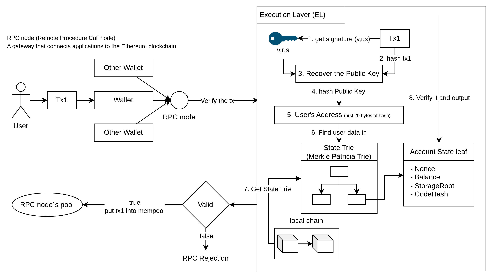
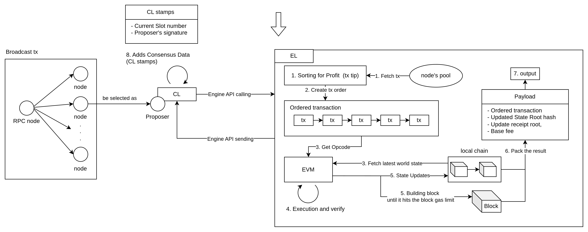
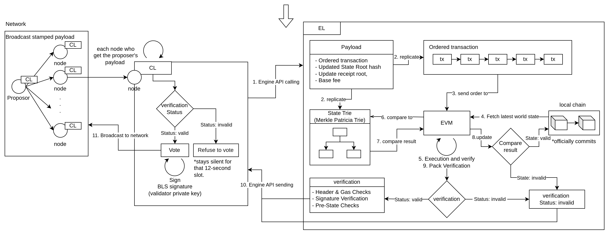
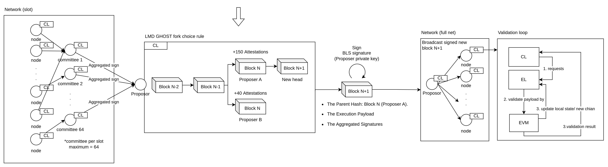

#### Estimated Transaction number in block

The number of transactions selected in a block depends on that block's `gasLimit` and the gas profile of included transactions. View live time gas limit: [Gas Limit monitor](https://eth.blockscout.com/stats/averageGasLimit?interval=threeMonths)

1. Extreme theoretical upper bound (simple ETH transfers only)

If all included transactions are the simplest ETH transfers (no smart-contract execution):

- **Gas per transaction:** fixed at **21,000 gas**.
- **Example (if `gasLimit = 30,000,000`):** 30,000,000 / 21,000 = 1,428.57
- **Conclusion for this example:** one completely full block can contain about **1,428 transactions**.

#### How Many Transactions Would Be Selected in a Block?

Use the block gas limit divided by average gas per transaction:

$$
TxPerBlock \approx \frac{GasLimit_{block}}{AvgGasPerTx}
$$

For the pure ETH transfer upper-bound example with `GasLimit_block = 30,000,000`:

$$
TxPerBlock_{max} \approx \frac{30,000,000}{21,000} \approx 1,428
$$

#### TPS Calculation

Assuming average block time is about 12 seconds:

$$
TPS = \frac{TxPerBlock}{BlockTimeSeconds}
$$

For the upper-bound simple-transfer case:

$$
TPS_{max} \approx \frac{1,428}{12} \approx 119
$$

So the theoretical maximum in this simplified scenario is about **119 TPS**.


## Part 3: Transaction flow types

A transaction is a signed, externally originated request to modify execution-layer state.

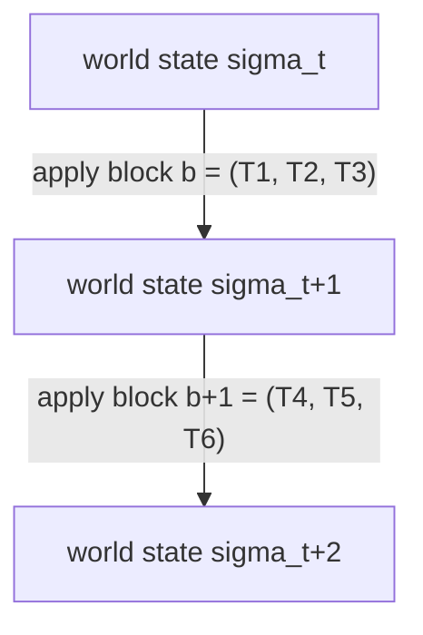

State transition function (conceptual):

$$
sigma_{t+1} = U(sigma_t, B_t)
$$

Where `U` is the block transition function and `B_t` is the ordered payload content processed at height `t`.

In modern Ethereum, block processing includes both transactions and protocol-level payload fields (for example withdrawals), so the post-state is not a function of transactions alone.

### Who Sends What to Whom

1. **User/Wallet**
- Creates and signs a transaction.
- Sends signed transaction bytes to an RPC node using `eth_sendRawTransaction`.
- May instead send private orderflow to a searcher/builder endpoint (not protocol-required).

2. **Node (RPC + txpool, EL client)**
- RPC accepts transaction submission.
- EL validates transaction and, if valid, stores it in txpool.
- Gossips transaction to other EL peers (public mempool path).

3. **Searcher (out-of-protocol)**
- Builds bundle/orderflow strategies.
- Sends bundles or private flow to builders/relays.
- Does not propose blocks in Ethereum consensus.

4. **Builder (out-of-protocol)**
- Builds candidate execution payloads from public mempool and/or private flow.
- Sends bids/payload commitments to relays.

5. **Relay (out-of-protocol)**
- Receives builder bids.
- Verifies bid/payload checks per relay policy.
- Forwards bid data to a proposer using MEV-Boost.

6. **Proposer (validator, in-protocol)**
- Is selected by CL for the slot.
- Proposes the beacon block.
- Uses either a local EL-built payload (no MEV-Boost) or a builder-provided payload (MEV-Boost path).

7. **CL vs EL responsibilities (in-protocol)**
- CL: proposer selection, fork choice, attestations, finality, beacon block propagation.
- EL: transaction validation, txpool, EVM execution, state transition, payload validity via Engine API.

### Canonical Flow A: Public Mempool Path (Baseline)

1. User signs tx in wallet.
2. Wallet sends signed tx to RPC node via `eth_sendRawTransaction`.
3. EL validates tx and admits it to local txpool if accepted.
4. EL gossips tx across EL P2P; peers repeat validation/admission.
5. At slot time, CL-selected proposer requests an execution payload from its EL.
6. Proposer's EL builds payload from available txpool transactions.
7. Proposer publishes beacon block (with execution payload) on CL network.
8. Other nodes validate with CL consensus checks + EL re-execution checks.
   
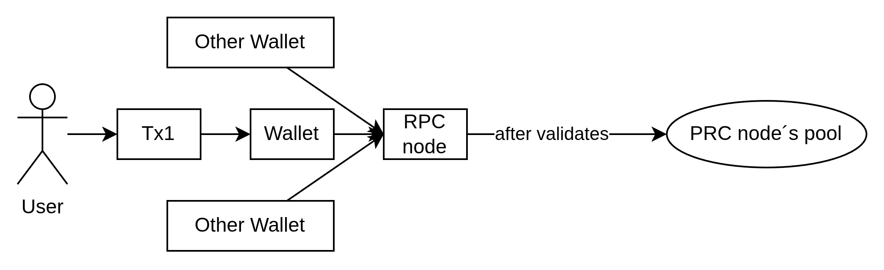

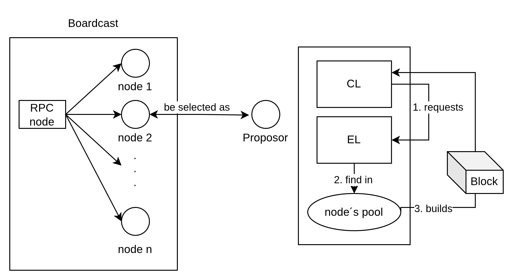

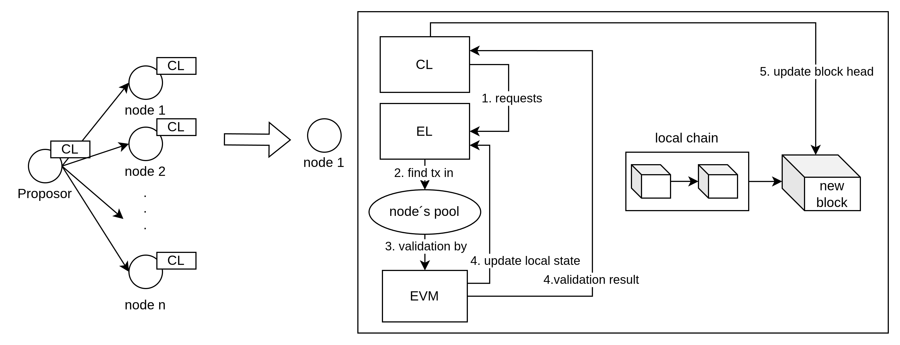

### Canonical Flow B: Private Orderflow / Searcher-Builder Path (MEV-Boost)

1. User/searcher sends private orderflow or bundles to builder channels.
2. Builders construct candidate payloads and attach bids.
3. Builders submit bids to relays.
4. Relays expose blinded bids to the slot proposer running MEV-Boost.
5. Proposer selects a valid bid and signs the blinded path.
6. Relay releases the full payload for the winning bid.
7. Proposer publishes the beacon block through CL.
8. Network validation remains in-protocol (CL + EL checks).

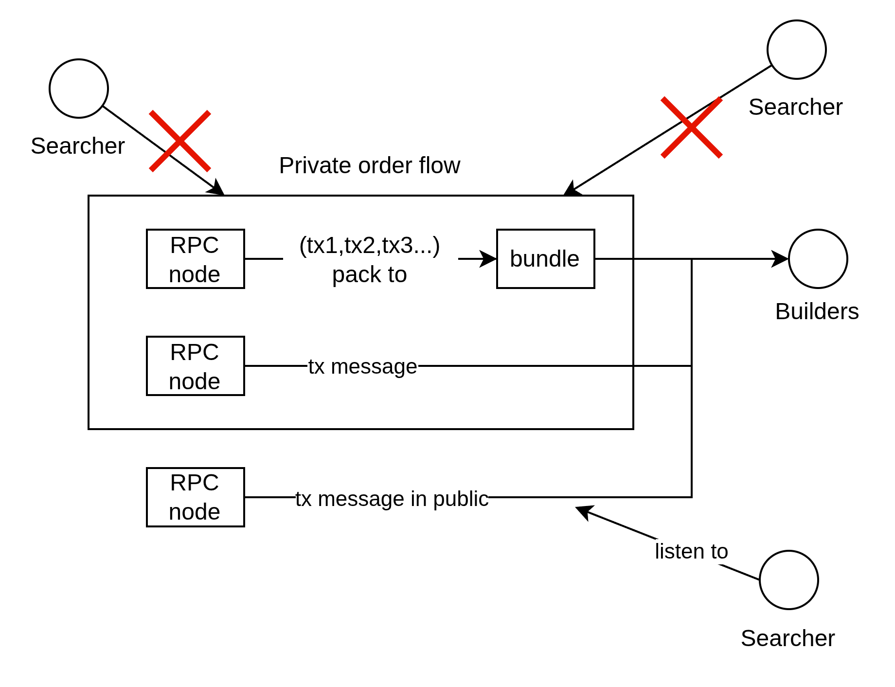

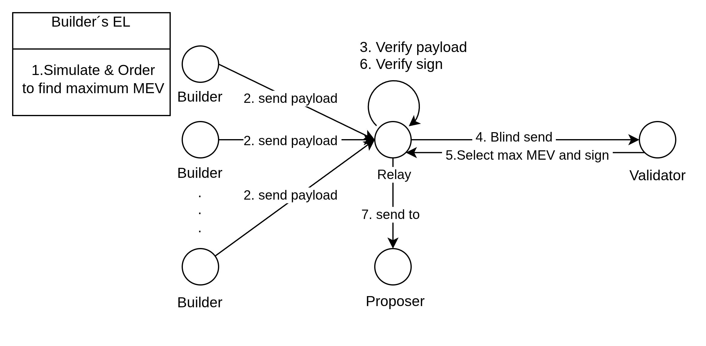

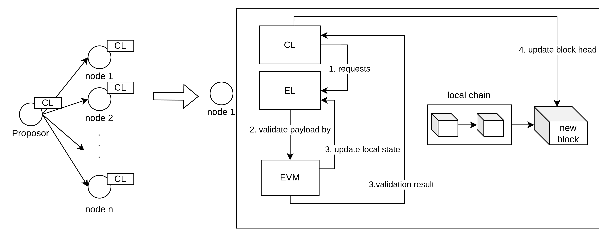

Important: builder/relay/MEV-Boost are out-of-protocol market infrastructure; Ethereum consensus/finality rules remain in CL + EL protocol clients.

### Canonical Flow C: Meta Transactions (Gasless)

A **Meta Transaction** is a pattern where the person who **creates and signs** the transaction is different from the entity that **pays the gas** to submit it to the blockchain.

#### The Problem It Solves
Normally, every Ethereum interaction requires the sender to hold ETH for gas. This is a significant onboarding hurdle. Meta transactions allow users to interact with dApps **without needing to hold any ETH**.

#### The Technical Flow (ERC-2771)

1.  **Off-chain Signature:** The user signs a message (e.g., "transfer 10 tokens") using their private key. This costs **zero gas** as it happens off-chain.
2.  **The Relayer:** The user sends this signed message to a **Relayer** (a third-party service).
3.  **The Broadcast:** The Relayer wraps the signed message in a standard Ethereum transaction, pays the gas fee, and broadcasts it.
4.  **Forwarder Verification:** A **Forwarder** contract (Standardized by **ERC-2771**) verifies the user's signature.
5.  **Execution:** If valid, the Forwarder calls the target smart contract. The target contract uses `_msgSender()` to identify the original signer instead of `msg.sender` (which would be the Relayer).

> **ERC-2771** is the industry standard that allows smart contracts to "look past" the Relayer/Forwarder and correctly identify the actual user who authorized the action.

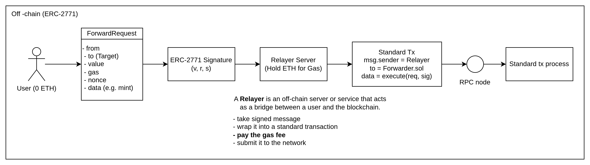

> The Relayer pays the ETH gas fees on-chain to the network. In return, the user can reimburse the Relayer using any ERC-20 token (such as USDC or USDT) either off-chain or via the smart contract. Alternatively, the dApp developers can fully subsidize the cost, providing a completely gasless experience for the user.

### Canonical Flow D: Account Abstraction (ERC-4337)

Account Abstraction (AA) is a paradigm shift that decouples the relationship between an account's signer (the key) and its balance (the ETH), allowing any smart contract to act as a wallet.

#### [](#the-useroperation-structure)The `UserOperation` structure
| Field                           | Type      | Description                                                                                           |
| ------------------------------- | --------- | ----------------------------------------------------------------------------------------------------- |
| `sender`                        | `address` | The Account making the `UserOperation`                                                                |
| `nonce`                         | `uint256` | Anti-replay parameter (see “Semi-abstracted Nonce Support” )                                          |
| `factory`                       | `address` | Account Factory for new Accounts OR `0x7702` flag for EIP-7702 Accounts, otherwise `address(0)`       |
| `factoryData`                   | `bytes`   | data for the Account Factory if `factory` is provided OR EIP-7702 initialization data, or empty array |
| `callData`                      | `bytes`   | The data to pass to the `sender` during the main execution call                                       |
| `callGasLimit`                  | `uint256` | The amount of gas to allocate the main execution call                                                 |
| `verificationGasLimit`          | `uint256` | The amount of gas to allocate for the verification step                                               |
| `preVerificationGas`            | `uint256` | Extra gas to pay the bundler                                                                          |
| `maxFeePerGas`                  | `uint256` | Maximum fee per gas (similar to [EIP-1559](/EIPS/eip-1559) `max_fee_per_gas`)                         |
| `maxPriorityFeePerGas`          | `uint256` | Maximum priority fee per gas (similar to EIP-1559 `max_priority_fee_per_gas`)                         |
| `paymaster`                     | `address` | Address of paymaster contract, (or empty, if the `sender` pays for gas by itself)                     |
| `paymasterVerificationGasLimit` | `uint256` | The amount of gas to allocate for the paymaster validation code (only if paymaster exists)            |
| `paymasterPostOpGasLimit`       | `uint256` | The amount of gas to allocate for the paymaster post-operation code (only if paymaster exists)        |
| `paymasterData`                 | `bytes`   | Data for paymaster (only if paymaster exists)                                                         |
| `signature`                     | `bytes`   | Data passed into the `sender` to verify authorization                                                 |

---
#### [](#entrypoint-interface)`EntryPoint` interface

When passed on-chain, to the `EntryPoint` contract, the `Account` and the `Paymaster`, a “packed” version of the above structure called `PackedUserOperation` is used:

| Field                | Type      | Description                                                                                                           |
| -------------------- | --------- | --------------------------------------------------------------------------------------------------------------------- |
| `sender`             | `address` |                                                                                                                       |
| `nonce`              | `uint256` |                                                                                                                       |
| `initCode`           | `bytes`   | concatenation of factory address and factoryData (or empty), or [EIP-7702 data](#support-for-eip-7702-authorizations) |
| `callData`           | `bytes`   |                                                                                                                       |
| `accountGasLimits`   | `bytes32` | concatenation of verificationGasLimit (16 bytes) and callGasLimit (16 bytes)                                          |
| `preVerificationGas` | `uint256` |                                                                                                                       |
| `gasFees`            | `bytes32` | concatenation of maxPriorityFeePerGas (16 bytes) and maxFeePerGas (16 bytes)                                          |
| `paymasterAndData`   | `bytes`   | concatenation of paymaster fields (or empty)                                                                          |
| `signature`          | `bytes`   |                                                                                                                       |

For more information, please reference [EIP4337](https://eips.ethereum.org/EIPS/eip-4337)

#### ERC-4337 End-to-End Workflow

**Phase 1: Off-Chain Intent & Bundling**
1.  **Signing the Intent:** The user signs a **UserOperation (UserOp)** via a dApp. This object describes the "intent" (e.g., "Transfer 50 USDC"). This happens off-chain and requires **zero ETH** from the user.
2.  **The Alt-Mempool:** The UserOp is sent to a dedicated **Alternative Mempool (Alt-Mempool)** specifically designed for UserOperations.
3.  **Bundling:** A **Bundler** collects multiple UserOps from the Alt-Mempool, packages them into a single **Standard Ethereum Transaction**, pays the gas fees using its own EOA, and submits it to a standard RPC node.

**Phase 2: Standard On-Chain Processing**

4.  **Block Inclusion:** Standard Ethereum nodes and Proposers treat the Bundler’s transaction like any other EOA-to-Contract call. They verify the Bundler's EOA balance and **Standard Nonce**, then include the bundle in a block.

**Phase 3: EVM-Level Smart Contract Execution**

5.  **Entry Point Invocation:** During block execution, the EVM reads the transaction as a call to the global **EntryPoint** contract's `handleOps` function.
6.  **Verification Loop:**
    *   `EntryPoint` calls each user's **Smart Contract Wallet (SCW)** to verify the custom signature (e.g., Passkey, Multi-sig) and an **independent AA Nonce**.
    *   If specified, it calls a **Paymaster** to confirm the Paymaster is willing to sponsor the gas fees for this UserOp.
7.  **Execution Loop:** Once verification is complete, the `EntryPoint` calls the SCW again to execute the actual business logic (e.g., the actual USDC transfer).
8.  **Settlement & Compensation:** The `EntryPoint` calculates the exact gas spent. It deducts the amount from the SCW or the Paymaster's pre-funded deposit and compensates the Bundler in ETH.

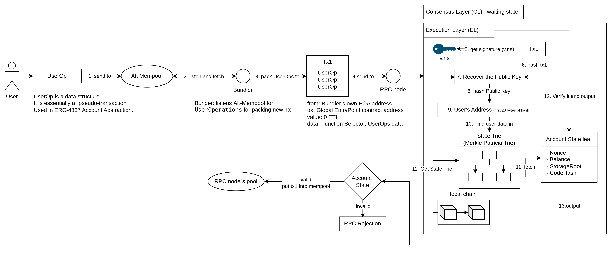
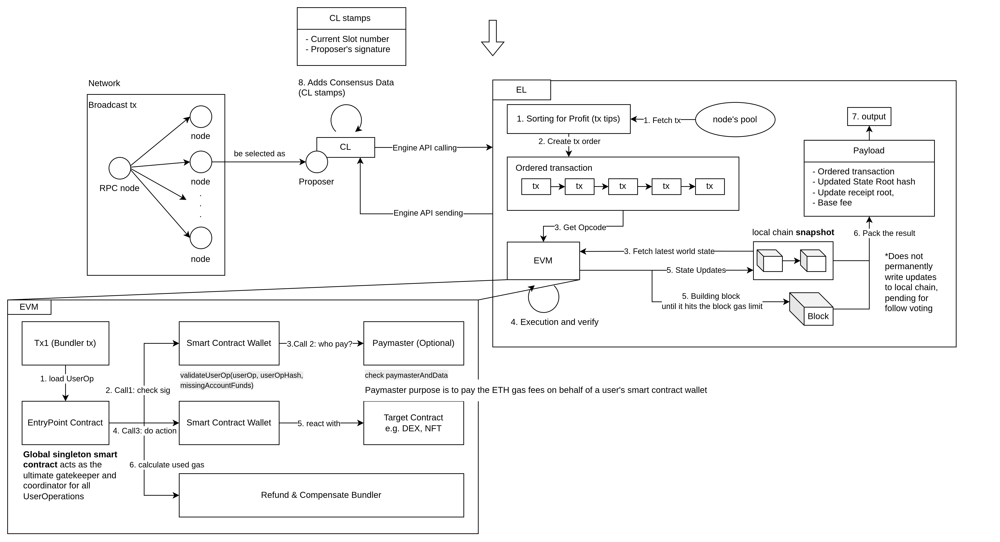


#### Core Roles and Details Comparison

| Role                            | Core Responsibility                                      | Key Nuances & Nonce Handling                                                                                                                                 |
| :------------------------------ | :------------------------------------------------------- | :----------------------------------------------------------------------------------------------------------------------------------------------------------- |
| **User**                        | Signs "UserOp" intent to authorize actions.              | **No EOA Nonce.** User doesn't need to hold ETH or manage a seed phrase; can use biometrics (FaceID/TouchID) or social recovery.                             |
| **SCW (Smart Contract Wallet)** | Verifies user signatures and executes final logic.       | **2D Nonce (Two-Dimensional):** Uses a custom Nonce mechanism independent of the base layer, allowing for parallel (non-blocking) transaction processing.    |
| **Bundler**                     | Simulates UserOps, bundles them, and pays upfront Gas.   | **Standard EOA Nonce.** Acts as a traditional EOA. Uses a standard incrementing Nonce. Takes the risk of failed Gas if execution fails on-chain.             |
| **EntryPoint**                  | Global coordinator, security gate, and settlement hub.   | **Stateless Singleton.** The ultimate trust anchor in the AA architecture. Ensures Bundlers are repaid and enforces the order of verification and execution. |
| **Paymaster**                   | Sponsors Gas fees based on custom logic.                 | **Deposit-based.** Enables "Gasless" UX or paying gas with ERC-20 tokens. Must pre-fund or stake ETH in the EntryPoint as collateral.                        |
| **Proposer / RPC Node**         | Validates and includes the standard transaction bundles. | **AA-Agnostic.** Only checks the Bundler's signature, base-layer Nonce, and balance. It sees it as a simple call to the EntryPoint bytecode.                 |


## Part 4: Transaction process

#### Transaction Creation and Propagation

- Creation: EOAs (or account-abstraction style user flows that still resolve to valid EL transaction envelopes) create a transaction with nonce, fee settings, recipient, value, and optional calldata, then sign it cryptographically.
- Broadcast: The signed transaction is sent to the peer-to-peer network, where nodes place it in their mempool (unconfirmed transaction pool).
- Propagation: Nodes relay valid transactions to peers after basic checks (field validity and signature verification). Mempool policies such as fee prioritization and eviction affect relay and retention.

#### Transmitting Value to EOAs and Contracts

Ethereum value transfers are processed based on the recipient type: transfers to EOAs only update balances, while transfers/calls to contracts can trigger code execution depending on calldata and whether `receive()`/`fallback()` is defined.

If a contract has no code path to move ETH out (for example, no callable withdrawal logic), ETH sent to it may become permanently inaccessible.

#### Transaction steps

[Detail flow with original code](/ethereum/eth-transaction-code/)

### 1. Entry Point

When you submit a transaction, the path depends on how it is signed:

* **Node-signed:** If you let the node sign the transaction, it enters through `eth_sendTransaction`.

  Use `eth_sendRawTransaction` when your app/user controls keys and you want the node to be broadcast-only.

* **Pre-signed:** If you have already signed the transaction yourself, it enters through `eth_sendRawTransaction`.
 
  `eth_sendTransaction` is often disabled on public RPC providers because it requires server-side key management.

* Both of these paths eventually converge in the client submission path, which forwards the transaction into local validation and txpool admission.

```text
[Node-Signed (eth_sendTransaction)]
Your app (unsigned tx data) -> Node (private key is managed here) -> [Node signs transaction] -> Broadcast to Ethereum network

[Pre-Signed (eth_sendRawTransaction)]
Your app or wallet (private key is managed here) -> [Local signing] -> Node (receives signed raw transaction bytes only) -> Broadcast to Ethereum network
```

### 2. Pre-checks (Validation)

Before entering the pool, the transaction undergoes multiple layers of checks:

* **RPC Layer:** Applies node/provider policy checks (for example configured fee caps), while protocol-validity checks (signature, chain-domain/replay protection, type/fork validity) are enforced in tx decoding/validation paths.
* **Txpool Stateless Validation:** Checks if the signature and sender are correct, if there is sufficient gas, if the transaction type matches current fork rules, and if structures like blobs or set-code authorizations are valid.
* **Txpool Stateful Validation:** Verifies if the nonce is too high or too low, if the account balance is sufficient, and if it complies with the pool's gap and slot rules.

### 3. Entering a Node's Txpool

Once the transaction passes validation, it is added to the transaction pool:

* **Queued/Future:** If there is a nonce gap (for example, a missing prior nonce), many clients keep the tx in a non-executable subpool.
* **Pending/Executable:** If the transaction can execute against current account nonce/balance constraints, it stays in an executable subpool.

Exact subpool names and promotion/eviction policies are client-specific (for example, Geth/Erigon/Nethermind differ).

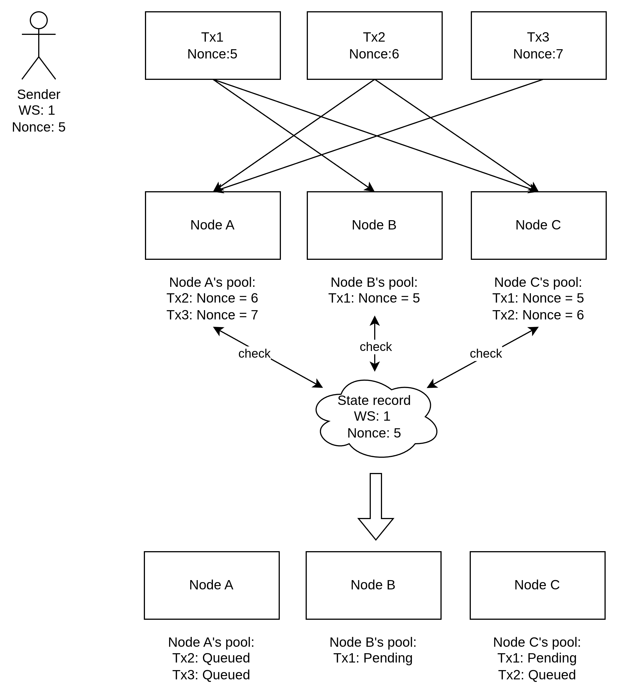

WS = World State, Tx = Transaction.

| Nonce Function             | Practical Effect                                                                        |
| -------------------------- | --------------------------------------------------------------------------------------- |
| Prevent replay attacks     | Makes each transaction unique, preventing copy-and-resend attacks.                      |
| Enforce transaction order  | Forces transactions from the same account to execute in sequence.                       |
| Replace stuck transactions | Lets you resubmit the same nonce with a higher fee to speed up or replace a pending tx. |
| Track account history      | Acts as a running counter of confirmed outgoing transactions for the account.           |

### 4. Broadcasting to Peers

The node shares the new transaction with the rest of the network:

* It broadcasts the transaction using an internal event system.
* Depending on protocol path and peer state, propagation may use announcements first (hashes/IDs) with bodies requested on demand.
* Propagation rules for blob transactions are strictly tighter than those for standard transactions.

### 5. Inclusion in a Block (Block Building)

In post-Merge Ethereum, block construction is commonly separated from block proposal through out-of-protocol **Proposer-Builder Separation (PBS)** infrastructure such as **MEV-Boost**.

#### MEV-Boost Role Format

* **Users and Searchers:** Users submit normal transactions (for example, raw transactions), while searchers submit bundles and orderflow designed for MEV strategies.
* **Builders:** Builders aggregate public mempool flow, private orderflow, and bundles, then construct candidate execution payloads and calculate bid value.
* **Relays:** Relays verify builder payload validity, publish **blinded** bids/headers, and route the winning payload path to the selected proposer.
* **Validator (Proposer):** The proposer requests headers, selects the highest-value valid bid, signs the selected header path, and proposes the corresponding beacon block through the Consensus Layer.

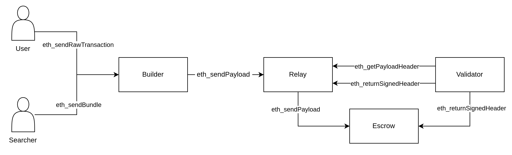

#### Role Onboarding (Registration vs Integration)

| Role                 | Protocol Registration Required | How to Start                                                                               | Key Requirements                                      |
| -------------------- | ------------------------------ | ------------------------------------------------------------------------------------------ | ----------------------------------------------------- |
| User                 | No                             | Use a wallet and submit transactions to RPC endpoints                                      | Wallet, ETH for gas                                   |
| Searcher             | No                             | Run search/strategy bots and submit bundles or orderflow to builders/relays                | MEV strategy logic, low-latency infra                 |
| Builder              | No                             | Run builder stack, ingest mempool and private flow, construct and bid payloads via relays  | Builder software, simulation engine, networking       |
| Relay Operator       | No                             | Operate relay service that validates builder payloads and serves blinded bids to proposers | High availability infra, validation and routing logic |
| Validator (Proposer) | Yes                            | Run consensus and execution clients and activate validator via Ethereum deposit flow       | 32 ETH stake per validator, CL+EL operation           |

#### MEV-Boost Flow
1. Users and searchers send transactions or bundles to builders (directly or through orderflow channels).
2. Builders construct execution payloads and submit them to relays.
3. Relays validate payloads and expose bid headers to the slot proposer.
4. The proposer selects a winning header/bid and signs the proposal path.
5. The full payload corresponding to the winning bid is released for proposal and execution.
6. The Consensus Layer proposes/gossips the block, and the local Execution Layer validates and executes the payload via Engine API.

#### Common Misconceptions (Quick Corrections)

- "Users send transactions directly to proposers."
  - Usually false: users send to RPC nodes or private orderflow endpoints.
- "Builder and proposer are the same protocol role."
  - No: proposer is in-protocol; builder is out-of-protocol infrastructure.
- "Relays are part of Ethereum consensus protocol."
  - No: relays are optional third-party infrastructure for MEV-Boost.
- "CL validates transactions."
  - EL validates/executes transactions; CL handles fork choice and finality.
- "RPC acceptance guarantees inclusion."
  - No: inclusion still depends on fee competitiveness, nonce ordering, and block space.


#### Block Building Step
1. **Fork-choice head selection (CL):** Before the auction, the proposer's CL determines the current canonical parent block for this slot. [Detail for PoS proposer selection](/ethereum/eth-pos/)
2. **MEV-Boost auction:** Builders construct payloads on top of that parent and submit bids through relays; the proposer requests and compares relay headers.
3. **Blind handshake:** The proposer signs the selected blinded header, and the relay releases the full execution payload for the winning bid path.
4. **Block assembly for proposal (CL):** The proposer CL assembles the beacon block using the winning execution payload reference/data and proposer signature.


### 6. EVM Execution

The transaction is processed by the Ethereum Virtual Machine (EVM):

1. **EL payload execution path:** EL clients execute/validate payloads through Engine API flows (for example new-payload handling).
2. **Deterministic transaction execution:** The EVM runs transactions in order, applying nonce checks, gas accounting, state transitions, and logs.
3. **Execution result status:** EL returns payload validity (`VALID`/`INVALID`/`SYNCING`) and related status fields (for example `latestValidHash`) to CL for downstream fork-choice processing.

### 7. Generating Receipts and Updating State

After execution, the results are recorded:

* Receipts include execution status, gas used, emitted logs, and the created contract address when deployment occurs.
* EL computes post-state commitments and receipt commitments (for example `stateRoot`, `receiptsRoot`, and final `gasUsed`) from deterministic execution output.
* These commitments become the claims that peers later verify during block validation/import.

### 8. Block Broadcast

After the proposer signs the block, the **Consensus Layer (CL)** client is responsible for propagating it over the Beacon Chain p2p network:

* The CL client (for example, Prysm or Lighthouse) broadcasts the beacon block (which carries execution payload data/commitments for that fork version) to peers.
* For proposer publication, the local **CL** gossips beacon blocks, while the local **EL** receives the selected execution payload via the **Engine API**.
* EL clients still participate in EL P2P request-response and sync data exchange for execution data.
* This is the end of proposer-side publishing for the slot; network-wide voting and head movement happen after peers receive the block.
* Other peers then run their own CL- and EL-side validation independently.

### 9. Block Validation and Import

When the block is received by other nodes (or imported locally), the transactions are verified again:

| Check Category            | Validation Logic                                                                                 | Impact if Failure                            |
| :------------------------ | :----------------------------------------------------------------------------------------------- | :------------------------------------------- |
| **Header & Consensus**    | Validates parent link, timestamp/slot constraints, block size limits, and consensus metadata.    | Block rejection (consensus violation).       |
| **Transaction Integrity** | Ensures each transaction encoding/signature is valid and all transaction-root commitments match. | Block rejection (invalid payload).           |
| **State Transition**      | Re-runs transactions in order; verifies nonces, account balances, and gas accounting.            | Execution failure; block invalidation.       |
| **Root & Receipts**       | Confirms computed `stateRoot`, `receiptsRoot`, and `transactionsRoot` match header claims.       | State mismatch; block rejection.             |
| **Gas & Fee Consistency** | Verifies `gasUsed`, EIP-1559 base-fee rules, and per-tx fee accounting are consistent.           | Protocol violation; block rejection.         |
| **Network Attestation**   | Validators that accept the block attest during slot/epoch voting to signal validity.             | Failure to reach finality/canonical status.  |
| **Fork-Choice Update**    | CL updates local canonical head as attestations accumulate (with EL coordination).               | Node stays on incorrect/old chain fork.      |
| **Import Decision**       | Valid blocks become candidates for canonical head; failed blocks are immediately dropped.        | Node maintains synchronization with network. |
  
---

## Part 5. Summary

- Ethereum transaction processing is a layered pipeline: submission -> txpool validation -> network propagation -> block inclusion -> EVM execution -> receipt/state commitment -> block broadcast -> block validation/import -> attestation and fork-choice head update.
- A transaction can be accepted by RPC but still be queued (nonce gap), deprioritized (fee conditions), or dropped (pool pressure/policy).
- Block headers commit execution outcomes via `stateRoot`, `transactionsRoot`, and `receiptsRoot`, while transaction data lives in the block body.
- Consensus safety is enforced at block import by re-validating execution results and commitment consistency before canonical insertion.
- Fork-choice can trigger reorgs; transactions from replaced blocks may return to the pool and compete for inclusion again.


